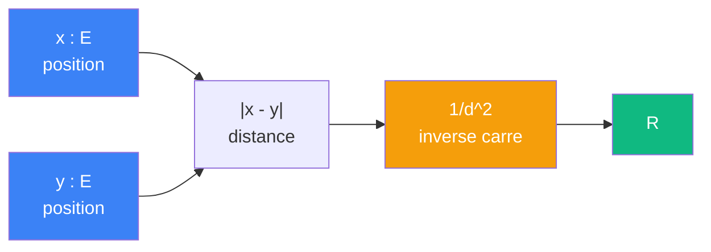

# Attirer

> [Retour aux sens](README.md)

`1/|x - y|^2`

- **Sens** -- combien une position attire l'autre
- **Contrat** -- `E x E -> R` (symetrique)
- **Ports** -- `x in E`, `y in E` (entrees), `R` (sortie)
- **Cablage** -- `x, y -> |x - y| -> 1/|.|^2 -> R`

## Comment ca marche



## Meme contrat qu'aligner

| | Aligner | Attirer |
|---|---|---|
| **Sens** | combien deux vecteurs s'alignent | combien une position attire l'autre |
| **Contrat** | `E x E -> R` | `E x E -> R` |
| **Cablage** | `integrale fg` | `1/|x - y|^2` |

Meme contrat, sens different, cablage different. C'est le meme phenomene que `abs` / `inv_carre` (`R -> R`) dans [encodage.md](../meta-objets/encodage.md), mais cette fois avec `E x E -> R`. La [triple distinction](../vocabulaire/triple-distinction.md) n'est pas redondante : deux paires d'objets le confirment.

## Currying d'attirer

Fixer une position `x` produit un **champ gravitationnel** :

```
curry(attirer)(x) = 1/|x - _|^2 : E -> R
```

Le [currying](../meta-objets/currying.md) transforme `E x E -> R` en `E -> (E -> R)`. La sortie est un bloc `E -> R` qui, pour chaque position `y`, donne l'intensite du pull exerce par `x`.

| | Avant | Apres |
|---|---|---|
| **Contrat** | `E x E -> R` | `E -> (E -> R)` |
| **Entrees** | `x : E`, `y : E` | `x : E` |
| **Sortie** | `R` | bloc `E -> R` (champ gravitationnel) |

## Currying + Godel

TODO -- champ gravitationnel currie comme entree dans le circuit de teleportation ; encodage Godel des poids d'attraction.

---

[← Ponderer](ponderer.md) | [Deplacer →](deplacer.md)
