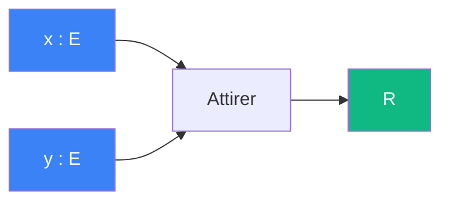

# Attirer

> [Retour aux sens](../README.md)

`1/|x - y|^2`

- **Sens** -- combien une position attire l'autre
- **Contrat** -- `E x E -> R` (symetrique)
- **Ports** -- `x in E`, `y in E` (entrees), `R` (sortie)

## Comment ca marche

## Meme contrat qu'aligner

| | Aligner | Attirer |
|---|---|---|
| **Sens** | combien deux vecteurs s'alignent | combien une position attire l'autre |
| **Contrat** | `E x E -> R` | `E x E -> R` |
| **Cablage** | `integrale fg` | `1/|x - y|^2` |

Meme contrat, sens different, cablage different. C'est le meme phenomene que `abs` / `inv_carre` (`R -> R`) dans [encodage.md](../../meta-objets/encodage.md), mais cette fois avec `E x E -> R`. La [triple distinction](../../vocabulaire/triple-distinction.md) n'est pas redondante : deux paires d'objets le confirment.

---

[← Ponderer](../ponderer/) | [Deplacer →](../deplacer/)
