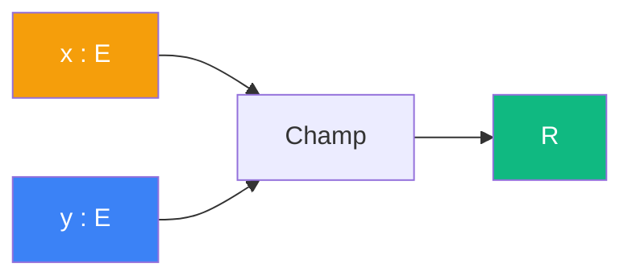

# Champ

> [Retour aux sens](../README.md)

`1/|x - _|^2`

- **Sens** -- mesurer l'attraction depuis un point fixe
- **Contrat** -- `E -> R`
- **Ports** -- `y in E` en entree ; `R` en sortie
- **Origine** -- [currying](../../meta-objets/currying.md) de [attirer](../attirer/), entree `x` fixee

## Comment ca marche



Le bloc `1/|x - _|^2` est un **champ gravitationnel** : pour chaque position `y`, il donne l'intensite du pull exerce par le point fixe `x`. C'est le resultat du [currying](../../meta-objets/currying.md) de [attirer](../attirer/).

```
curry(attirer)(x) = 1/|x - _|^2 : E -> R
```

| | Attirer | Champ |
|---|---|---|
| **Contrat** | `E x E -> R` | `E -> R` |
| **Entrees** | `x : E`, `y : E` | `y : E` |
| **Sortie** | `R` | `R` |

---

[← Amplifier](../amplifier/) | [Translater →](../translater/)
