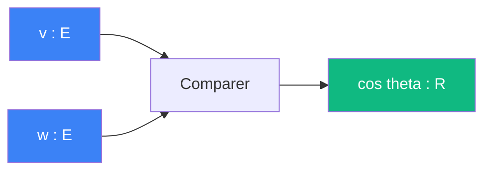

# Comparer

> [Retour aux sens](../README.md)

`cos theta`

- **Sens** -- angle entre deux vecteurs
- **Contrat** -- `E x E -> R` (symetrique)
- **Ports** -- `v in E`, `w in E` (entrees), `R` (sortie)

## Trio `E x E -> R`

Trois sens partagent le meme contrat `E x E -> R` mais avec des cablages et des sens differents :

| | Aligner | Attirer | Comparer |
|---|---|---|---|
| **Sens** | combien deux vecteurs s'alignent | combien une position attire l'autre | angle entre deux vecteurs |
| **Contrat** | `E x E -> R` | `E x E -> R` | `E x E -> R` |
| **Cablage** | `integrale fg` | `1/\|x - y\|^2` | `<v,w> / (\|\|v\|\| * \|\|w\|\|)` |
| **Sortie** | `R` quelconque | `R_+` | `[-1, 1]` |

Meme contrat, trois sens, trois cablages. La [triple distinction](../../vocabulaire/triple-distinction.md) s'applique a chacun.

## Comment ca marche

## Cablages

### Quotient normalise
[comparer/quotient-normalise.md](quotient-normalise.md)

- cablage local

### Rencontrer
[aligner/rencontrer.md](../aligner/rencontrer.md)

- `v=v_rel, w=delta(0)` → diagnostic approche/eloignement

---

[<- Normer](../normer/) | [Sonder ->](../sonder/)
