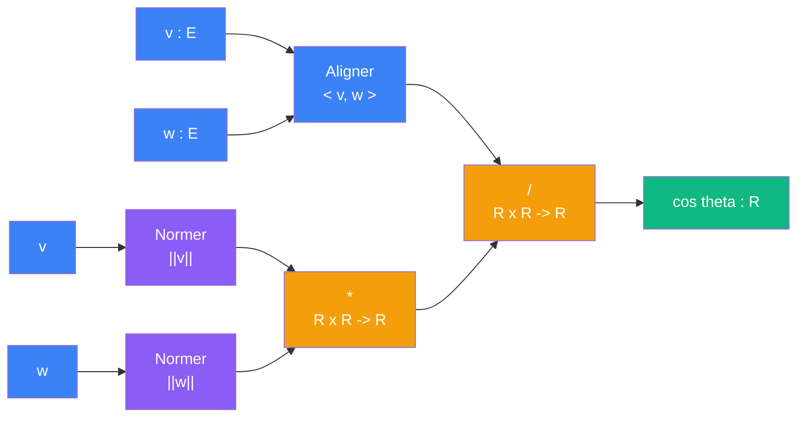

# Comparer -- cablage

> [Retour au sens Comparer](README.md)

## Comment ca marche

Le quotient normalise divise l'alignement brut par le produit des tailles. Le resultat est `cos theta in [-1, 1]` :

| Valeur | Interpretation |
|--------|----------------|
| `+1` | meme direction |
| `0` | perpendiculaires |
| `-1` | opposes |

## Blocs reutilises

| Bloc | Contrat | Role |
|------|---------|------|
| [Aligner](../aligner/) | `E x E -> R` | produit scalaire brut |
| [Normer](../normer/) | `E -> R` | taille de chaque vecteur |
| [Ponderer](../ponderer/) | `R x R -> R` | produit des normes |

## Triple distinction

| Dimension | Comparer |
|-----------|----------|
| **Sens** | angle entre deux vecteurs |
| **Contrat** | `E x E -> R` |
| **Cablage** | Aligner + 2x Normer + produit + division |
