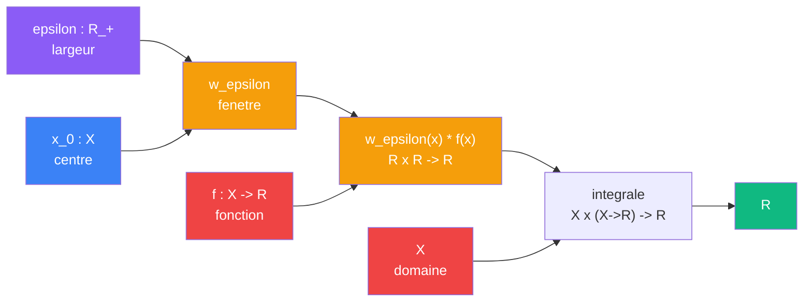

# Concentrer

> [Retour aux sens](README.md) | [Exemples](../cablages/concentration.md)

`lim_{epsilon -> 0} integrale w_epsilon * f`

- **Sens** -- passer du global au local
- **Contrat** -- `R_+ x X x (X -> R) -> R` (asymetrique)
- **Ports** -- `epsilon in R_+` (largeur), `x_0 in X` (centre), `f in (X -> R)` (fonction a lire) en entree ; `R` en sortie
- **Cablage** -- `epsilon, x_0 -> w_epsilon -> w_epsilon * f -> integrale -> R`

## Comment ca marche

La concentration est une **famille parametree** de fenetres `w_epsilon` centree en `x_0`. Chaque fenetre produit une integration ponderee. Quand `epsilon -> 0`, la fenetre se concentre et l'integration devient une lecture :

```
integrale_X w_epsilon(x) * f(x) dx  --->  f(x_0)
```



## Currying de la concentration

Par [currying](../meta-objets/currying.md), on peut fixer les parametres un par un :

| Entrees fixees | Contrat restant | Ce qu'on obtient |
|----------------|----------------|-----------------|
| aucune | `R_+ x X x (X -> R) -> R` | la concentration complete |
| `epsilon` | `X x (X -> R) -> R` | une concentration a echelle fixee |
| `epsilon`, `x_0` | `(X -> R) -> R` | un **covecteur** : une forme lineaire sur les fonctions |
| `epsilon`, `x_0`, `f` | `R` | un nombre : le volume capte |

Le cas le plus important est le troisieme : fixer `epsilon` et `x_0` produit un **lecteur de fonctions** de type `(X -> R) -> R`. C'est un covecteur dans l'espace dual des fonctions.

```
curry(concentrer)(epsilon)(x_0) : (X -> R) -> R
```

## La limite : delta de Dirac

Quand `epsilon -> 0`, le covecteur `curry(concentrer)(epsilon)(x_0)` converge vers `delta_{x_0}` :

```
delta_{x_0} : (X -> R) -> R
delta_{x_0}(f) = f(x_0)
```

C'est le [produit de dualite](observer.md) qui reapparait un niveau au-dessus :

| Niveau | Covecteur | Vecteur | Produit de dualite |
|--------|----------|---------|-------------------|
| vecteurs | `phi : E*` | `v : E` | `<phi \| v> = phi(v)` |
| fonctions | `delta_{x_0} : (X -> R)*` | `f : X -> R` | `<delta_{x_0} \| f> = f(x_0)` |

## Blocs reutilises

| Bloc | Contrat | Role |
|------|---------|------|
| [Produit lineaire](ponderer.md) | `R x R -> R` | ponderation `w_epsilon(x) * f(x)` en chaque point |
| Integration | `X x (X -> R) -> R` | somme ponderee sur le domaine |
| [Produit de dualite](observer.md) | `E* x E -> R` | structure limite (`delta_{x_0}`) |

## Currying + Godel

TODO -- covecteur currie `(X -> R) -> R` comme entree Godel ; lien avec la boucle auto-referente dans [ecouter](../cablages/ecouter.md).

---

[← Deplacer](deplacer.md) | [Espaces →](espaces.md)
