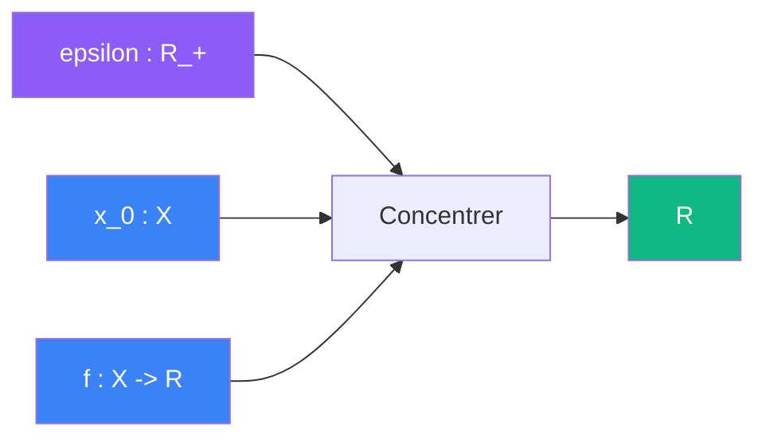

# Concentrer

> [Retour aux sens](../README.md) | [Exemples](exemples.md)

`lim_{epsilon -> 0} integrale w_epsilon * f`

- **Sens** -- passer du global au local
- **Contrat** -- `R_+ x X x (X -> R) -> R` (asymetrique)
- **Ports** -- `epsilon in R_+` (largeur), `x_0 in X` (centre), `f in (X -> R)` (fonction a lire) en entree ; `R` en sortie

## Comment ca marche

La concentration est une **famille parametree** de fenetres `w_epsilon` centree en `x_0`. Chaque fenetre produit une integration ponderee. Quand `epsilon -> 0`, la fenetre se concentre et l'integration devient une lecture :

```
integrale_X w_epsilon(x) * f(x) dx  --->  f(x_0)
```



---

[← Deplacer](../deplacer/) | [Normer →](../normer/)
