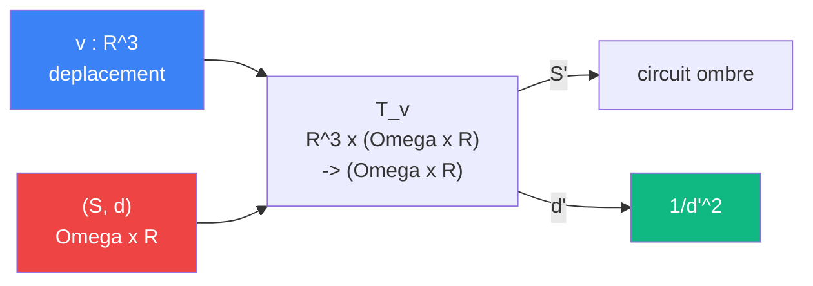

# Deplacer

> [Retour aux sens](README.md)

`T_v(S, d)`

- **Sens** -- translater la sphere, changer la distance
- **Contrat** -- `R^3 x (Omega x R) -> (Omega x R)` (asymetrique)
- **Ports** -- `v in R^3` (deplacement), `(S, d) in Omega x R` (sphere + distance) en entree ; `(S', d') in Omega x R` en sortie
- **Cablage** -- `v, (S, d) -> (S + v, |d + proj(v)|) -> (Omega x R)`

## Comment ca marche

Le mouvement est le bloc **en amont** de `d` dans le [circuit de l'ombre](../cablages/projeter.md). Deplacer la sphere modifie `d`, donc modifie `1/d^2`, donc modifie l'aire apparente. La sphere elle-meme (`Omega`) est transmise telle quelle au produit de dualite.

## Currying du mouvement

Le [currying](../meta-objets/currying.md) fixe le deplacement `v` et produit un operateur sur les spheres :

| | Avant | Apres |
|---|---|---|
| **Contrat** | `R^3 x (Omega x R) -> (Omega x R)` | `R^3 -> ((Omega x R) -> (Omega x R))` |
| **Entrees** | `v : R^3`, `(S, d) : Omega x R` | `v : R^3` |
| **Sortie** | `(S', d') : Omega x R` | bloc `(Omega x R) -> (Omega x R)` |

Le bloc `T_v(_)` est un **operateur de translation** : il attend une sphere avec sa distance et produit la sphere translatee avec la nouvelle distance. Composer plusieurs `T_v` revient a additionner les vecteurs de deplacement.

## Currying + Godel

TODO -- composition de translations curriees ; encodage Godel d'un operateur de translation ; lien avec le circuit de teleportation dans [ecouter](../cablages/ecouter.md).

---

[← Attirer](attirer.md) | [Concentrer →](concentrer.md)
