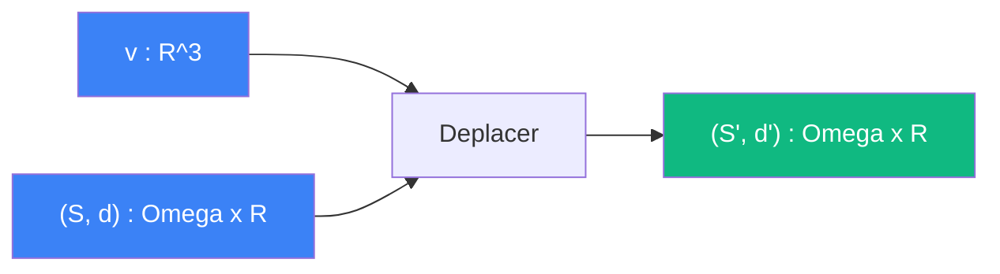

# Deplacer

> [Retour aux sens](../README.md)

`T_v(S, d)`

- **Sens** -- translater la sphere, changer la distance
- **Contrat** -- `R^3 x (Omega x R) -> (Omega x R)` (asymetrique)
- **Ports** -- `v in R^3` (deplacement), `(S, d) in Omega x R` (sphere + distance) en entree ; `(S', d') in Omega x R` en sortie

## Comment ca marche

Le mouvement est le bloc **en amont** de `d` dans le [circuit de l'ombre](../observer/projeter.md). Deplacer la sphere modifie `d`, donc modifie `1/d^2`, donc modifie l'aire apparente. La sphere elle-meme (`Omega`) est transmise telle quelle au produit de dualite.

## Cablages

### Projeter
[observer/projeter.md](../observer/projeter.md)

- `v=deplacement, (S,d)=sphere` → sphere deplacee `(S',d')`

---

[← Attirer](../attirer/) | [Concentrer →](../concentrer/)
