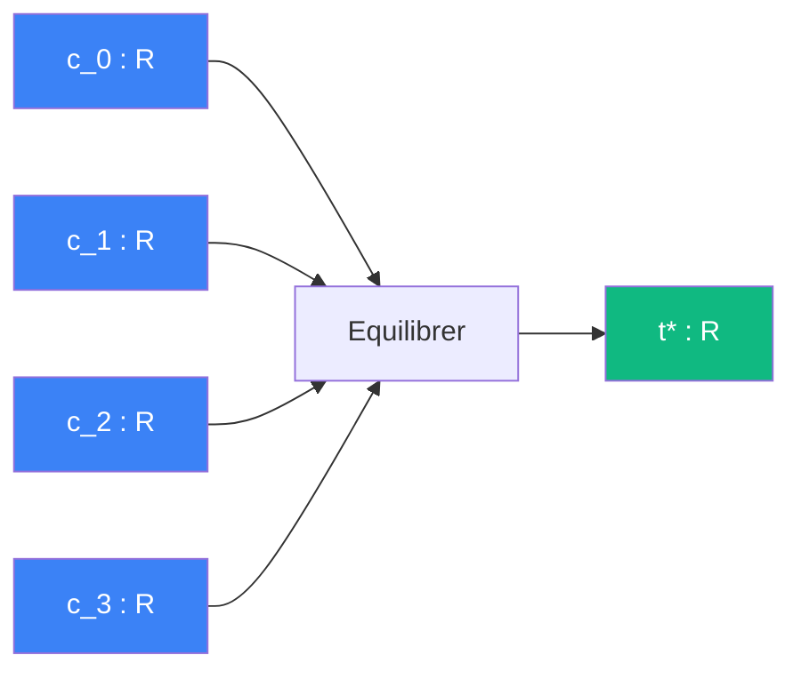

# Equilibrer

> [Retour aux sens](../README.md)

`c_0 + c_1*t + c_2*t^2 + c_3*t^3 = 0 -> t*`

- **Sens** -- trouver l'instant ou approche et eloignement s'equilibrent (vitesse radiale nulle)
- **Contrat** -- `R^4 -> R` (asymetrique : 4 coefficients -> plus petite racine reelle positive)
- **Ports** -- `c_0, c_1, c_2, c_3 in R` (entrees), `t* in R` (sortie)

## Cablages

### Rencontrer Accelere
[equilibrer/rencontrer-accelere.md](rencontrer-accelere.md)

- instant de distance minimale entre deux spheres accelerees

### Resolution cubique
[equilibrer/resolution-cubique.md](resolution-cubique.md)

- cablage local : resolution du polynome cubique

### Viser
[equilibrer/viser.md](viser.md)

- instant de distance minimale entre un projectile accelere et une cible fixe

## Comment ca marche

---

[<- Accelerer](../accelerer/) | [Amplifier ->](../amplifier/)
