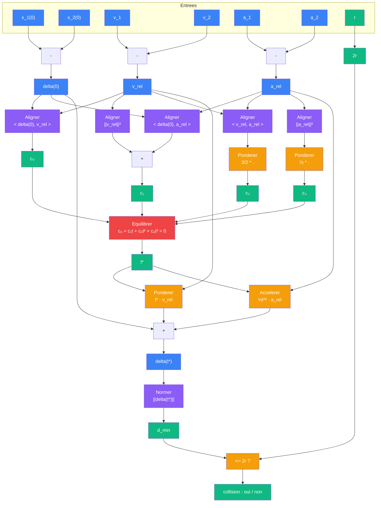
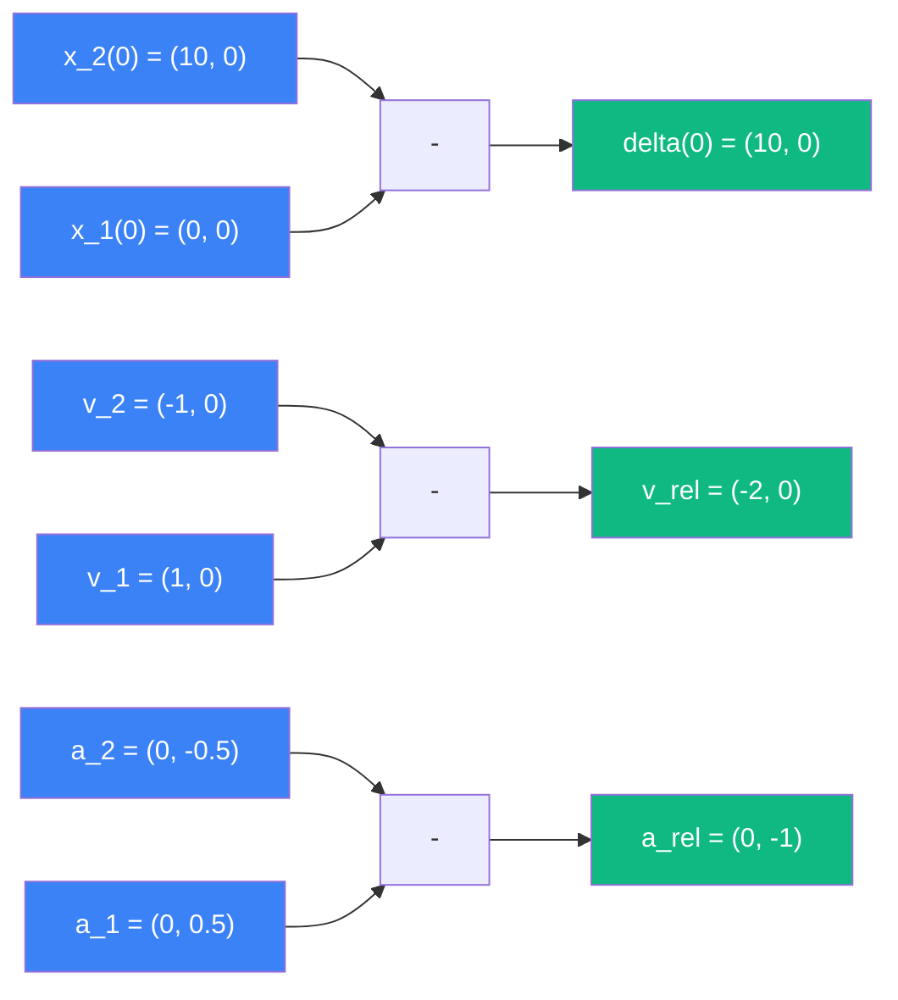
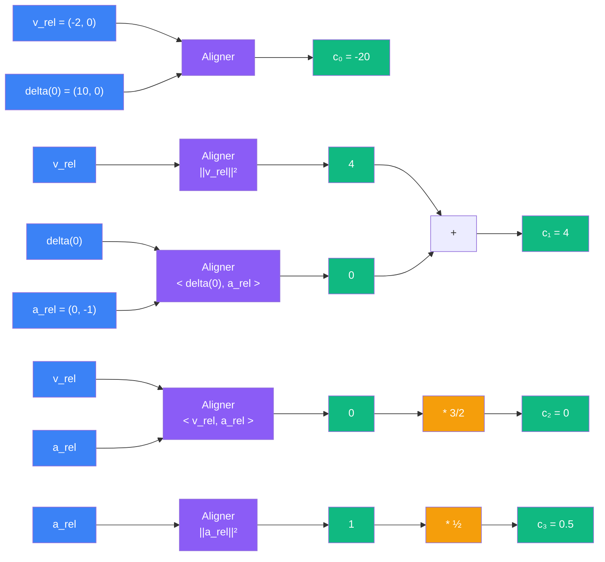
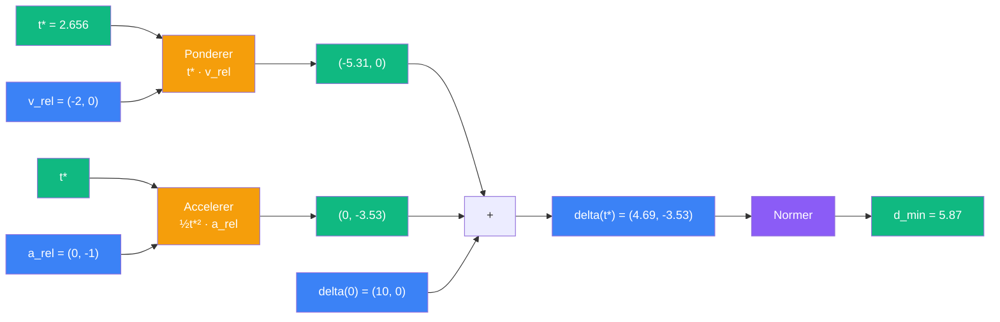

# Rencontrer Accelere

> [Retour au sens Equilibrer](README.md) | [Version lineaire](../aligner/rencontrer.md)

## Le probleme

Deux spheres de rayon `r`, positions initiales `x_1(0)` et `x_2(0)`, vitesses `v_1` et `v_2`, **accelerations constantes** `a_1` et `a_2`. Trajectoires quadratiques :

```
x_i(t) = x_i(0) + t * v_i + ½ * t² * a_i
```

Questions (les memes que [Rencontrer](../aligner/rencontrer.md)) :
1. Se rapprochent-elles ?
2. A quel instant sont-elles le plus proches ?
3. Y a-t-il collision ?

## Entrees

| Entree | Type | Role |
|--------|------|------|
| `x_1(0)`, `x_2(0)` | E | positions initiales |
| `v_1`, `v_2` | E | vitesses initiales |
| `a_1`, `a_2` | E | accelerations constantes |
| `r` | R | rayon des spheres |

## Phases du circuit

| Phase | Bloc | Calcul |
|-------|------|--------|
| 1 -- Separation | `-` | `delta(0) = x_2(0) - x_1(0)` |
| 2 -- Vitesse relative | `-` | `v_rel = v_2 - v_1` |
| 3 -- Acceleration relative | `-` | `a_rel = a_2 - a_1` |
| 4 -- Coefficients | [Aligner](../aligner/) x5 | produits scalaires pour la cubique |
| 5 -- Instant critique | [Equilibrer](README.md) | `d/dt \|\|delta(t)\|\|² = 0` |
| 6 -- Distance minimale | [Accelerer](../accelerer/) + [Ponderer](../ponderer/) + [Normer](../normer/) | `delta(t*) = delta(0) + t*·v_rel + ½t*²·a_rel` |
| 7 -- Collision | [Normer](../normer/) + test | `\|\|delta(t*)\|\| <= 2r` |

## Detail des phases

### Phases 1-3 -- Grandeurs relatives

Le vecteur de separation evolue quadratiquement :

```
delta(t) = delta(0) + t * v_rel + ½ * t² * a_rel
```

avec :
- `delta(0) = x_2(0) - x_1(0)`
- `v_rel = v_2 - v_1`
- `a_rel = a_2 - a_1`

C'est la meme structure que [Rencontrer](../aligner/rencontrer.md), avec une soustraction supplementaire pour `a_rel`.

### Phase 4 -- Coefficients

On veut minimiser `||delta(t)||²`. Sa derivee fait apparaitre une **cubique** en `t`. Les coefficients sont tous des produits scalaires ([Aligner](../aligner/)) :

| Produit scalaire | Valeur |
|------------------|--------|
| `<delta(0), v_rel>` | a₀ |
| `<v_rel, v_rel>` = `\|\|v_rel\|\|²` | a₁ |
| `<v_rel, a_rel>` | a₂ |
| `<delta(0), a_rel>` | a₃ |
| `<a_rel, a_rel>` = `\|\|a_rel\|\|²` | a₄ |

### Phase 5 -- L'equation cubique

On minimise `||delta(t)||²`. Posons `f(t) = ||delta(t)||²` :

```
f(t) = ||delta(0)||² + 2t<delta(0), v_rel> + t²(||v_rel||² + <delta(0), a_rel>)
       + t³<v_rel, a_rel> + ¼t⁴||a_rel||²
```

Sa derivee :

```
f'(t) = 2<delta(0), v_rel>
      + 2t(||v_rel||² + <delta(0), a_rel>)
      + 3t²<v_rel, a_rel>
      + t³||a_rel||²
      = 0
```

En posant les coefficients de la cubique :

```
c₀ = <delta(0), v_rel>
c₁ = ||v_rel||² + <delta(0), a_rel>
c₂ = (3/2)<v_rel, a_rel>
c₃ = ½||a_rel||²
```

L'equation devient :

```
c₀ + c₁·t + c₂·t² + c₃·t³ = 0
```

**Resolution** : [Equilibrer](README.md) recoit `(c₀, c₁, c₂, c₃)` et retourne la plus petite racine reelle positive `t*`.

> **Comparaison avec Rencontrer lineaire** : dans le cas sans acceleration (`a_rel = 0`), on a `c₂ = c₃ = 0` et l'equation se reduit a `c₀ + c₁·t = 0`, soit `t* = -c₀/c₁ = -<delta(0), v_rel> / ||v_rel||²` -- exactement la formule de [Rencontrer](../aligner/rencontrer.md).

### Phase 6 -- Distance minimale

On injecte `t*` dans `delta(t)` :

```
delta(t*) = delta(0) + t* · v_rel + ½ · t*² · a_rel
```

Le terme `½t*²·a_rel` est calcule par [Accelerer](../accelerer/). Les deux termes sont additionnes pour obtenir la position relative a l'instant critique.

### Phase 7 -- Collision

[Normer](../normer/) donne la distance minimale. Si `||delta(t*)|| <= 2r`, collision.

## Diagramme



## Exemple concret

Deux spheres de rayon `r = 1`, en 2D :

```
Sphere A : x_1(0) = (0, 0),   v_1 = (1, 0),   a_1 = (0, 0.5)
Sphere B : x_2(0) = (10, 0),  v_2 = (-1, 0),  a_2 = (0, -0.5)
```

### Phases 1-3 -- Grandeurs relatives



```
delta(0) = (10, 0) - (0, 0)     = (10, 0)
v_rel    = (-1, 0) - (1, 0)     = (-2, 0)
a_rel    = (0, -0.5) - (0, 0.5) = (0, -1)
```

### Phase 4 -- Coefficients



```
<delta(0), v_rel> = 10*(-2) + 0*0      = -20
||v_rel||²        = (-2)² + 0²          = 4
<delta(0), a_rel> = 10*0 + 0*(-1)       = 0
<v_rel, a_rel>    = (-2)*0 + 0*(-1)     = 0
||a_rel||²        = 0² + (-1)²          = 1

c₀ = -20
c₁ = 4 + 0         = 4
c₂ = (3/2) * 0     = 0
c₃ = ½ * 1         = 0.5
```

### Phase 5 -- Equation cubique

```
c₀ + c₁·t + c₂·t² + c₃·t³ = 0
-20 + 4t + 0.5t³ = 0
```

Soit, en multipliant par 2 :

```
t³ + 8t - 40 = 0
```

Resolution par Newton (depart `t = 3`) :

| Iteration | t | f(t) = t³ + 8t - 40 |
|-----------|---|---------------------|
| 0 | 3.000 | 27 + 24 - 40 = 11 |
| 1 | 2.649 | 18.59 + 21.19 - 40 = -0.22 |
| 2 | 2.656 | 18.74 + 21.25 - 40 = -0.01 |
| 3 | 2.656 | converge |

```
t* ≈ 2.656
```

### Phase 6 -- Distance minimale



```
t* · v_rel      = 2.656 * (-2, 0)       = (-5.31, 0)
½ · t*² · a_rel = ½ * 7.054 * (0, -1)   = (0, -3.53)

delta(t*) = (10, 0) + (-5.31, 0) + (0, -3.53)
          = (4.69, -3.53)

||delta(t*)|| = sqrt(4.69² + 3.53²) = sqrt(22.0 + 12.46) = sqrt(34.46) ≈ 5.87
```

### Phase 7 -- Collision

```
2r = 2

5.87 > 2 → pas de collision
```

L'acceleration verticale fait diverger les trajectoires lateralement. Sans acceleration (cas lineaire), `t* = -(-20)/4 = 5` et `delta(5) = (0, 0)` : collision frontale parfaite. L'acceleration brise cette symetrie.

## Triple distinction

| Dimension | Rencontrer Accelere |
|-----------|---------------------|
| **Sens** | deux spheres accelerees se rencontrent-elles ? |
| **Contrat** | `(E x E x E x E x E x E x R) -> {oui, non}` |
| **Cablage** | 7 phases : separation, v_rel, a_rel, coefficients, equilibrer, distance, collision |

## Objets reutilises

| Bloc | Occurrences | Role |
|------|-------------|------|
| [Aligner](../aligner/) | x5 | produits scalaires des coefficients |
| [Ponderer](../ponderer/) | x3+ | `3/2 * .`, `½ * .`, `t* · v_rel` |
| [Accelerer](../accelerer/) | x1 | `½t*² · a_rel` |
| [Equilibrer](README.md) | x1 | instant critique `t*` |
| [Normer](../normer/) | x1 | `\|\|delta(t*)\|\|` |
