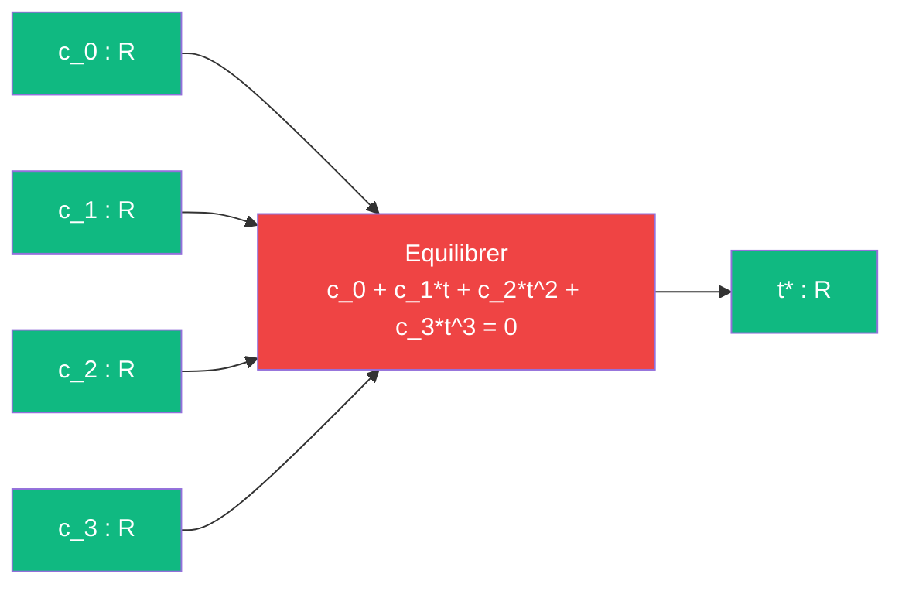

# Equilibrer -- cablage

> [Retour au sens Equilibrer](README.md)

## Comment ca marche

Toute trajectoire quadratique `p(t) = p_0 + t*v + 1/2*t^2*a` a une distance au carre `||p(t) - cible||^2` qui est un **polynome de degre 4** en `t`. Sa derivee est une **cubique**. Les coefficients de cette cubique sont des produits scalaires ([Aligner](../aligner/)) des donnees du probleme.

Equilibrer recoit ces 4 coefficients et retourne `t*`, l'instant ou la vitesse radiale s'annule -- approche et eloignement s'equilibrent.



## Les coefficients

Pour une trajectoire `delta(t) = delta(0) + t*v + 1/2*t^2*a`, les coefficients sont :

```
c_0 = <delta(0), v>
c_1 = ||v||^2 + <delta(0), a>
c_2 = (3/2)<v, a>
c_3 = 1/2*||a||^2
```

Tous sont produits par [Aligner](../aligner/) (produits scalaires) et [Ponderer](../ponderer/) (facteurs constants).

## Cas degeneres

| Condition | Equation | Resolution |
|-----------|----------|------------|
| `c_3 = 0, c_2 = 0` | lineaire `c_0 + c_1*t = 0` | `t* = -c_0/c_1` (cas de [Rencontrer](../aligner/rencontrer.md)) |
| `c_3 = 0` | quadratique | formule classique |
| `c_3 != 0` | cubique | Newton ou Cardan |

Le cas lineaire est exactement la division simple de [Rencontrer](../aligner/rencontrer.md). Equilibrer generalise ce calcul.

## Triple distinction

| Dimension | Equilibrer |
|-----------|------------|
| **Sens** | instant ou approche et eloignement s'equilibrent |
| **Contrat** | `R^4 -> R` |
| **Cablage** | resolution cubique (Newton ou Cardan) |
