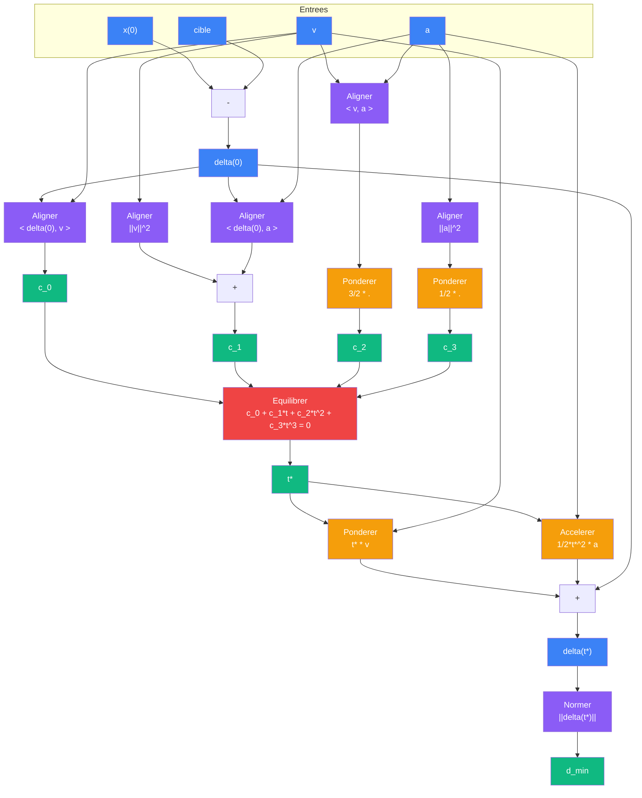

# Viser

> [Retour au sens Equilibrer](README.md) | [Version deux corps](rencontrer-accelere.md)

## Le probleme

Un projectile de position initiale `x(0)`, vitesse `v`, acceleration constante `a`. Une cible fixe `cible`. Trajectoire quadratique :

```
x(t) = x(0) + t * v + 1/2 * t^2 * a
```

Question : a quel instant le projectile passe-t-il au plus pres de la cible, et quelle est la distance minimale ?

## Entrees

| Entree | Type | Role |
|--------|------|------|
| `x(0)` | E | position initiale du projectile |
| `v` | E | vitesse initiale |
| `a` | E | acceleration constante |
| `cible` | E | position de la cible fixe |

## Phases du circuit

| Phase | Bloc | Calcul |
|-------|------|--------|
| 1 -- Separation | `-` | `delta(0) = x(0) - cible` |
| 2 -- Coefficients | [Aligner](../aligner/) x5 | produits scalaires pour la cubique |
| 3 -- Instant critique | [Equilibrer](README.md) | `t*` |
| 4 -- Distance minimale | [Accelerer](../accelerer/) + [Ponderer](../ponderer/) + [Normer](../normer/) | `||delta(t*)||` |

## Detail des phases

### Phase 1 -- Separation

```
delta(0) = x(0) - cible
```

Le vecteur de separation evolue quadratiquement :

```
delta(t) = delta(0) + t * v + 1/2 * t^2 * a
```

C'est le meme schema que [Rencontrer Accelere](rencontrer-accelere.md), mais avec `v_rel = v` et `a_rel = a` (la cible est fixe).

### Phase 2 -- Coefficients

On veut minimiser `||delta(t)||^2`. Sa derivee fait apparaitre une **cubique** en `t`. Les coefficients sont tous des produits scalaires ([Aligner](../aligner/)) :

| Produit scalaire | Valeur |
|------------------|--------|
| `<delta(0), v>` | a_0 |
| `<v, v>` = `||v||^2` | a_1 |
| `<v, a>` | a_2 |
| `<delta(0), a>` | a_3 |
| `<a, a>` = `||a||^2` | a_4 |

Les coefficients de la cubique :

```
c_0 = <delta(0), v>
c_1 = ||v||^2 + <delta(0), a>
c_2 = (3/2)<v, a>
c_3 = 1/2*||a||^2
```

### Phase 3 -- Instant critique

[Equilibrer](README.md) recoit `(c_0, c_1, c_2, c_3)` et retourne `t*`, l'instant ou approche et eloignement s'equilibrent.

### Phase 4 -- Distance minimale

On injecte `t*` dans `delta(t)` :

```
delta(t*) = delta(0) + t* * v + 1/2 * t*^2 * a
```

Le terme `1/2*t*^2*a` est calcule par [Accelerer](../accelerer/). [Normer](../normer/) donne la distance minimale.

## Diagramme



## Exemple concret

Un projectile en 2D avec gravite :

```
x(0) = (0, 0)
v     = (10, 10)
a     = (0, -10)     (gravite)
cible = (15, 5)
```

### Phase 1 -- Separation

```
delta(0) = (0, 0) - (15, 5) = (-15, -5)
```

### Phase 2 -- Coefficients

```
<delta(0), v>   = (-15)*10 + (-5)*10    = -200
||v||^2         = 10^2 + 10^2           = 200
<delta(0), a>   = (-15)*0 + (-5)*(-10)  = 50
<v, a>          = 10*0 + 10*(-10)       = -100
||a||^2         = 0^2 + (-10)^2         = 100

c_0 = -200
c_1 = 200 + 50      = 250
c_2 = (3/2)*(-100)  = -150
c_3 = 1/2 * 100     = 50
```

### Phase 3 -- Equation cubique

```
-200 + 250t - 150t^2 + 50t^3 = 0
```

En divisant par 50 :

```
t^3 - 3t^2 + 5t - 4 = 0
```

Resolution par Newton (depart `t = 1`) :

| Iteration | t | f(t) |
|-----------|---|------|
| 0 | 1.000 | 1 - 3 + 5 - 4 = -1 |
| 1 | 1.333 | 2.37 - 5.33 + 6.67 - 4 = -0.30 |
| 2 | 1.430 | converge |

```
t* ~ 1.43
```

### Phase 4 -- Distance minimale

```
t* * v         = 1.43 * (10, 10)         = (14.3, 14.3)
1/2*t*^2 * a   = 1/2 * 2.045 * (0, -10) = (0, -10.22)

delta(t*) = (-15, -5) + (14.3, 14.3) + (0, -10.22)
          = (-0.7, -0.92)

||delta(t*)|| = sqrt(0.49 + 0.85) = sqrt(1.34) ~ 1.16
```

Le projectile passe a environ 1.16 de la cible a `t* ~ 1.43`.

## Triple distinction

| Dimension | Viser |
|-----------|-------|
| **Sens** | un projectile accelere passe-t-il pres d'une cible fixe ? |
| **Contrat** | `(E x E x E x E) -> R` (distance minimale) |
| **Cablage** | 4 phases : separation, coefficients, equilibrer, distance |

## Objets reutilises

| Bloc | Occurrences | Role |
|------|-------------|------|
| [Aligner](../aligner/) | x5 | produits scalaires des coefficients |
| [Ponderer](../ponderer/) | x3 | `3/2 * .`, `1/2 * .`, `t* * v` |
| [Equilibrer](README.md) | x1 | instant critique `t*` |
| [Accelerer](../accelerer/) | x1 | `1/2*t*^2 * a` |
| [Normer](../normer/) | x1 | `||delta(t*)||` |

## Lien avec Rencontrer Accelere

Viser est le cas particulier de [Rencontrer Accelere](rencontrer-accelere.md) ou le second corps est immobile (`v_2 = 0`, `a_2 = 0`). Les phases de coefficients et d'equilibre sont identiques -- seule la phase de separation est simplifiee (pas de vitesse ni acceleration relative).
