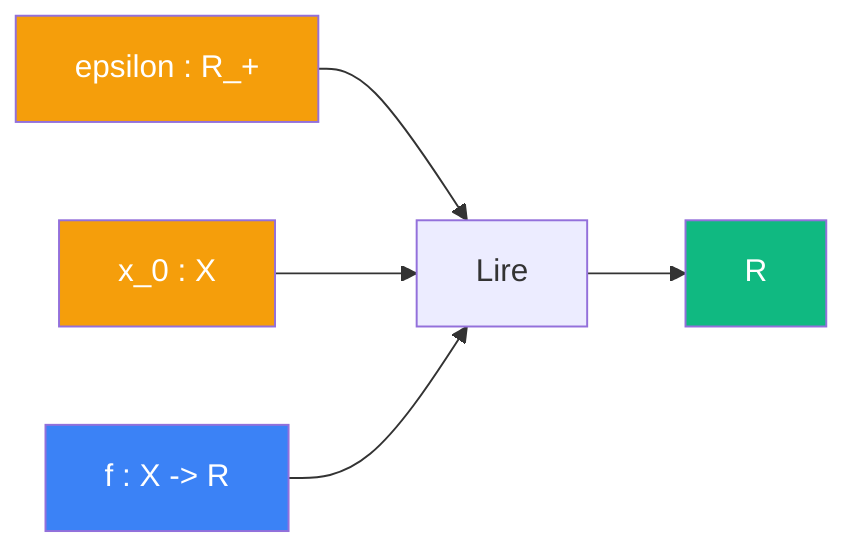

# Lire

> [Retour aux sens](../README.md)

`curry(concentrer)(epsilon)(x_0)`

- **Sens** -- evaluer toute fonction en un point (covecteur)
- **Contrat** -- `(X -> R) -> R`
- **Ports** -- `f in (X -> R)` en entree ; `R` en sortie
- **Origine** -- [currying](../../meta-objets/currying.md) de [concentrer](../concentrer/), entrees `epsilon` et `x_0` fixees

## Comment ca marche



Fixer `epsilon` et `x_0` dans [concentrer](../concentrer/) produit un **lecteur de fonctions** de type `(X -> R) -> R`. C'est un covecteur dans l'espace dual des fonctions.

Quand `epsilon -> 0`, ce covecteur converge vers la **delta de Dirac** `delta_{x_0}` :

```
delta_{x_0}(f) = f(x_0)
```

C'est le [produit de dualite](../observer/) qui reapparait un niveau au-dessus :

| Niveau | Covecteur | Vecteur | Produit de dualite |
|--------|----------|---------|-------------------|
| vecteurs | `phi : E*` | `v : E` | `<phi \| v> = phi(v)` |
| fonctions | `delta_{x_0} : (X -> R)*` | `f : X -> R` | `<delta_{x_0} \| f> = f(x_0)` |

| | Concentrer | Lire |
|---|---|---|
| **Contrat** | `R_+ x X x (X -> R) -> R` | `(X -> R) -> R` |
| **Entrees** | `epsilon`, `x_0`, `f` | `f` |
| **Sortie** | `R` | `R` |

---

[← Translater](../translater/) | [Mesurer →](../mesurer/)
