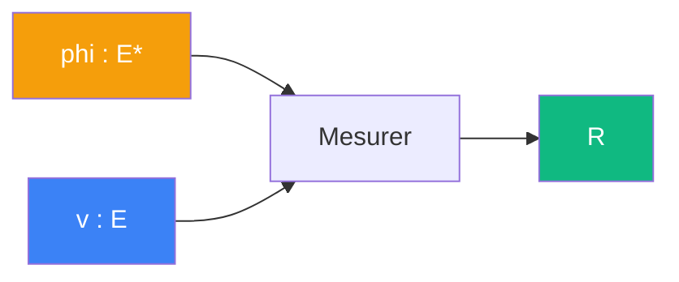

# Mesurer

> [Retour aux sens](../README.md)

`phi(_)`

- **Sens** -- lire tout vecteur selon un instrument fixe
- **Contrat** -- `E -> R`
- **Ports** -- `v in E` en entree ; `R` en sortie
- **Origine** -- [currying](../../meta-objets/currying.md) de [observer](../observer/), entree `phi` fixee

## Comment ca marche



Fixer `phi` dans [observer](../observer/) produit une **forme lineaire** `E -> R` : un instrument de mesure qui lit tout vecteur selon une direction fixee.

```
curry(observer)(phi) = phi(_) : E -> R
```

| | Observer | Mesurer |
|---|---|---|
| **Contrat** | `E* x E -> R` | `E -> R` |
| **Entrees** | `phi : E*`, `v : E` | `v : E` |
| **Sortie** | `R` | `R` |

---

[← Lire](../lire/) | [Espaces →](../../vocabulaire/espaces.md)
