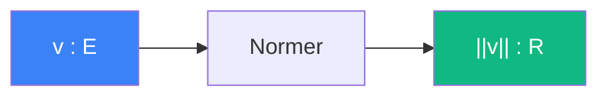

# Normer

> [Retour aux sens](../README.md)

`||v||`

- **Sens** -- taille d'un vecteur
- **Contrat** -- `E -> R`
- **Ports** -- `v in E` (entree), `R` (sortie)

## Comment ca marche

## Cablages

### Auto-aligner
[normer/auto-aligner.md](auto-aligner.md)

- `v=v` → `sqrt(<v,v>)` = `||v||`

### Quotient normalise
[comparer/quotient-normalise.md](../comparer/quotient-normalise.md)

- `v=v` → `||v||` et `v=w` → `||w||` (denominateur)

### Rencontrer
[aligner/rencontrer.md](../aligner/rencontrer.md)

- `v=delta(0)` → `||delta(0)||` et `v=delta(t*)` → `||delta(t*)||`

### Resolution cubique
[equilibrer/resolution-cubique.md](../equilibrer/resolution-cubique.md)

- norme dans les coefficients

---

[<- Concentrer](../concentrer/) | [Comparer ->](../comparer/)
