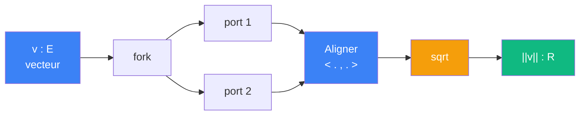

# Normer -- cablage

> [Retour au sens Normer](README.md)

## Comment ca marche

On branche le meme vecteur `v` sur les deux ports de [Aligner](../aligner/). Le produit scalaire `<v,v>` mesure le carre de la taille. La racine carree donne la norme.

## Blocs reutilises

| Bloc | Contrat | Role |
|------|---------|------|
| [Aligner](../aligner/) | `E x E -> R` | `<v,v>` par auto-application |
| sqrt | `R_+ -> R_+` | racine carree |

## Triple distinction

| Dimension | Normer |
|-----------|--------|
| **Sens** | taille d'un vecteur par auto-application |
| **Contrat** | `E -> R` |
| **Cablage** | fork -> Aligner -> sqrt |
