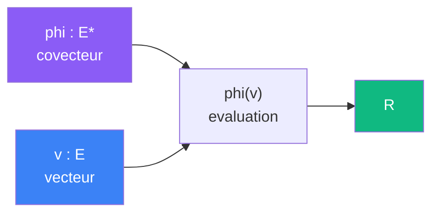

# Observer

> [Retour aux sens](README.md)

`<phi|v>`

- **Sens** -- evaluation de v par phi
- **Contrat** -- `E* x E -> R` (asymetrique)
- **Ports** -- `phi in E*`, `v in E` (entrees), `R` (sortie)
- **Cablage** -- `phi, v -> phi(v) -> R`

## Comment ca marche

Le produit de dualite est le cablage le plus direct : `phi` recoit `v`, l'evalue, et produit un scalaire. C'est une **lecture** — `phi` decide quoi mesurer, `v` fournit la matiere.

## Reduction de l'espace

Le produit de dualite est une **reduction** : il projette un vecteur `v in E` (plusieurs composantes) sur un scalaire `R` (une seule valeur). L'information perdue est controlee par `phi` : c'est `phi` qui decide quoi garder de `v`.

| | Avant | Apres |
|---|---|---|
| **Espace** | `E` (dim n) | `R` (dim 1) |
| **Information** | toutes les composantes de `v` | uniquement "combien `v` va dans la direction `phi`" |
| **Perdu** | les composantes de `v` orthogonales a `phi` |

Dans l'[exemple de la sphere](../cablages/projeter.md), `phi` reduit la normale `n(x) in E` a l'intensite `|<phi|n(x)>| in R` : de 3 composantes directionnelles a un seul scalaire de contribution.

## Currying + Godel

TODO -- fixer phi produit une forme lineaire `E -> R` ; encodage Godel de l'evaluation curriee.

---

[← Aligner](aligner.md) | [Ponderer →](ponderer.md)
