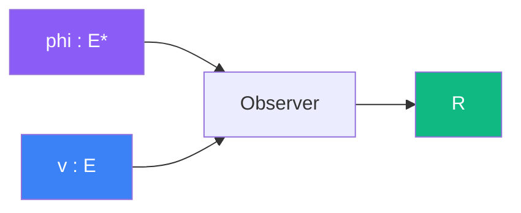

# Observer

> [Retour aux sens](../README.md)

`<phi|v>`

- **Sens** -- evaluation de v par phi
- **Contrat** -- `E* x E -> R` (asymetrique)
- **Ports** -- `phi in E*`, `v in E` (entrees), `R` (sortie)

## Comment ca marche

Le produit de dualite est le cablage le plus direct : `phi` recoit `v`, l'evalue, et produit un scalaire. C'est une **lecture** — `phi` decide quoi mesurer, `v` fournit la matiere.

## Cablages

### Projeter
[observer/projeter.md](projeter.md)

- `phi=direction, v=n(x) normales` → intensite locale `|<phi|n(x)>|`

### Ecouter
[concentrer/ecouter.md](../concentrer/ecouter.md)

- produit de dualite dans la structure limite

---

[← Aligner](../aligner/) | [Ponderer →](../ponderer/)
