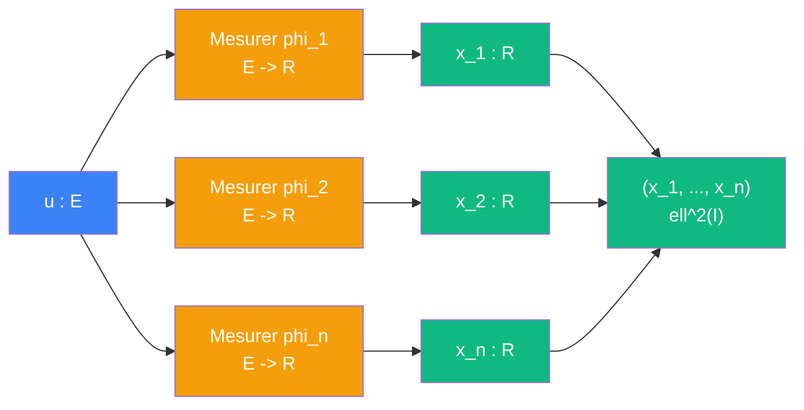

# Cablage : analyser

> [Retour au sens Observer](README.md) | [Synthetiser](synthetiser.md) | [Projeter sur V](projeter-v.md)

## Le probleme

On a une fonction `u` dans L^2 et une famille `{phi_k}` de fonctions (un frame). On veut decomposer `u` en coefficients : combien de chaque `phi_k` contient `u` ?

Chaque coefficient est un [Mesurer](../mesurer/) : fixer `phi_k`, lire `u`. Empiler tous les Mesurer donne l'operateur d'analyse.

## Circuit



## Role de chaque bloc

| Etape | Bloc | Contrat | Sens |
|-------|------|---------|------|
| 1 | [Mesurer](../mesurer/) phi_k | `E -> R` | currying d'[Observer](README.md), phi_k fixe |
| 2 | Empiler | `R^n -> ell^2(I)` | collecter les scalaires en vecteur de coefficients |

## Notation du papier

```
Phi* : L^2(Omega) -> ell^2(I)
Phi* := [ <phi_k| ]_{k in I}     (colonne de bras)
x~* = Phi* u                      (vecteur de coefficients)
```

Chaque ligne de Phi* est un bra `<phi_k|` = un [Mesurer](../mesurer/).

## Triple distinction

| Dimension | Analyser |
|-----------|----------|
| **Sens** | decomposer une fonction sur un frame |
| **Contrat** | `E -> ell^2(I)` |
| **Cablage** | n Mesurer en parallele + empiler |

## Lien avec les autres fiches

- Chaque `<phi_k|` est un [currying](../../meta-objets/currying.md) d'[Observer](README.md)
- L'operation inverse est [Synthetiser](synthetiser.md)
- Analyser + Synthetiser = [Projeter sur V](projeter-v.md)
- Les produits `<phi_m|phi_n>` entre elements du frame donnent la [Gram](../aligner/gram.md)

---

[<- Observer](README.md) | [Synthetiser ->](synthetiser.md)
