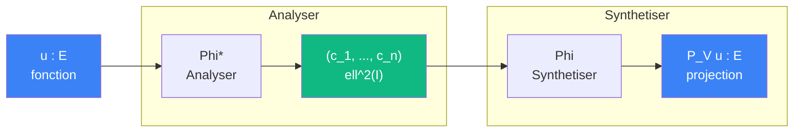
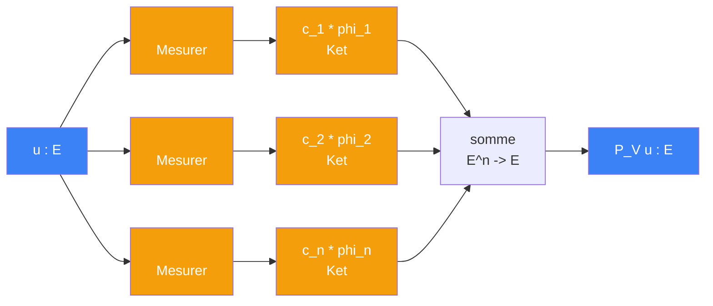

# Cablage : projeter sur V

> [Retour au sens Observer](README.md) | [Analyser](analyser.md) | [Synthetiser](synthetiser.md) | [Gram](../aligner/gram.md)

## Le probleme

On a une fonction `u` dans L^2 et un sous-espace V engendre par un frame `{phi_k}`. On veut la **projection** de `u` sur V : la meilleure approximation de `u` dans V.

Le circuit est : [Analyser](analyser.md) `u` en coefficients, puis [Synthetiser](synthetiser.md) pour reconstruire la composante dans V.

## Circuit (cas orthonormal)



Developpe, le circuit est une somme de **ket-bra** `|phi_k><phi_k|` :



## Circuit (cas non orthonormal)

Si le frame n'est pas orthonormal, il faut corriger par la [Gram](../aligner/gram.md) inverse :


Ce qui revient a utiliser la **base duale** `Phi~ = Phi G^{-1}` pour synthetiser :

```
P_V u = Phi~ (Phi* u) = Phi G^{-1} Phi* u
```

## Role de chaque bloc

| Etape | Bloc | Contrat | Sens |
|-------|------|---------|------|
| 1 | [Analyser](analyser.md) (Phi*) | `E -> ell^2(I)` | decomposer `u` en coefficients |
| 2 | [Gram](../aligner/gram.md) inverse (si non orthonormal) | `ell^2(I) -> ell^2(I)` | corriger les coefficients |
| 3 | [Synthetiser](synthetiser.md) (Phi) | `ell^2(I) -> E` | reconstruire la projection |

## Resolution de l'identite

Quand `{phi_k}` est une base **orthonormale** de V :

- `Phi* Phi = I` (Gram = identite) → les elements sont independants
- `Phi Phi* = P_V` (projecteur) → analyser + synthetiser reconstruit exactement la composante dans V
- Restreint a V : `P_V = I_V` (identite sur V)

C'est la **resolution de l'identite** : l'identite sur V se decompose en somme de ket-bra `|phi_k><phi_k|`.

## Noyau reproduisant

Le projecteur s'ecrit aussi via un **noyau** K_V :

```
K_V(tau, sigma) := somme_k  phi_k(tau) phi_k(sigma)
(P_V u)(tau)    := integrale_Omega  K_V(tau, sigma) u(sigma) d sigma
```

K_V **concentre** : il ne retient de `u` que sa composante dans V. C'est un cablage [Concentrer](../concentrer/) ou la fenetre est le noyau lui-meme.

## Triple distinction

| Dimension | Projeter sur V |
|-----------|----------------|
| **Sens** | extraire de `u` sa meilleure approximation dans V |
| **Contrat** | `E -> E` (idempotent : `P_V^2 = P_V`) |
| **Cablage** | [Analyser](analyser.md) + [Gram inverse] + [Synthetiser](synthetiser.md) |

## Objets reutilises

| Objet | Combien de fois | Roles |
|-------|----------------|-------|
| [Mesurer](../mesurer/) `E -> R` | n | chaque `<phi_k\|u>` dans l'analyse |
| [Aligner](../aligner/) `E x E -> R` | n^2 | dans la [Gram](../aligner/gram.md) (si necessaire) |
| [Ponderer](../ponderer/) `R x R -> R` | n | chaque `c_k * phi_k` dans la synthese |
| [Currying](../../meta-objets/currying.md) | 2n | bras (fixer phi_k dans Observer) + kets (fixer phi_k dans Ponderer) |

---

[<- Gram](../aligner/gram.md) | [Projeter (sphere) ->](projeter.md)
