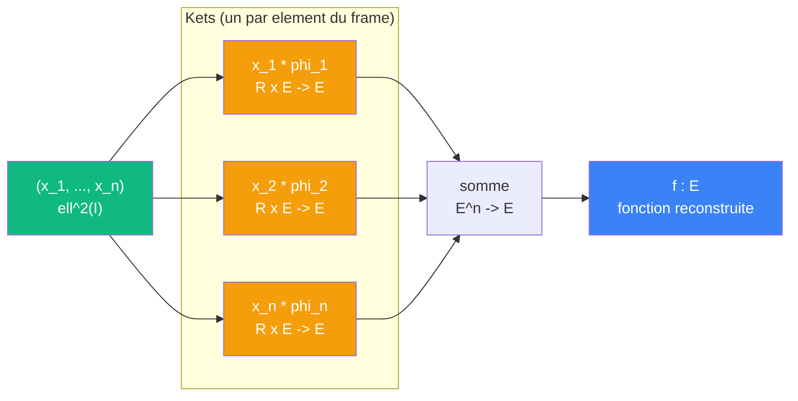

# Cablage : synthetiser

> [Retour au sens Observer](README.md) | [Analyser](analyser.md) | [Projeter sur V](projeter-v.md)

## Le probleme

On a des coefficients `(x_1, ..., x_n)` et une famille `{phi_k}`. On veut reconstruire une fonction : chaque coefficient pondere son `phi_k`, puis on somme. C'est l'operation duale d'[Analyser](analyser.md).

## Circuit



## Role de chaque bloc

| Etape | Bloc | Contrat | Sens |
|-------|------|---------|------|
| 1 | Ket `\|phi_k>` | `R -> E` | [currying](../../meta-objets/currying.md) : fixer `phi_k`, ponderer par le coefficient |
| 2 | Somme | `E^n -> E` | superposition des contributions |

## Notation du papier

```
Phi : ell^2(I) -> V
Phi := [ ... |phi_k> ... ]_{k in I}     (ligne de kets)
x(t) = (Phi x~)(t)                       (fonction reconstruite)
```

Chaque colonne de Phi est un ket `|phi_k>` : un operateur qui transforme un coefficient en contribution fonctionnelle.

## Triple distinction

| Dimension | Synthetiser |
|-----------|-------------|
| **Sens** | reconstruire une fonction a partir de coefficients |
| **Contrat** | `ell^2(I) -> E` |
| **Cablage** | n kets en parallele + somme |

## Symetrie avec Analyser

| | Analyser (Phi*) | Synthetiser (Phi) |
|---|---|---|
| **Direction** | E -> ell^2(I) | ell^2(I) -> E |
| **Brique** | bra `<phi_k\|` = Mesurer | ket `\|phi_k>` = ponderer + injecter |
| **Assemblage** | empiler en colonne | aligner en ligne |
| **Sens** | decomposer | recomposer |

Le lien entre les deux est l'**adjunction** : Phi et Phi* sont adjoints l'un de l'autre.

---

[<- Analyser](analyser.md) | [Gram ->](../aligner/gram.md)
