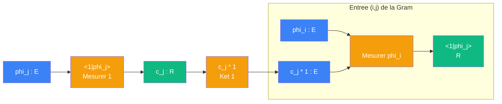
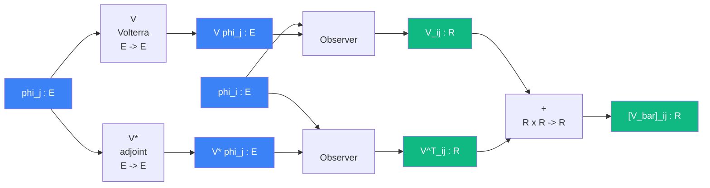

# Cablage : Volterra (V^T + V = 11^T)

> [Retour au sens Observer](README.md) | [Analyser](analyser.md) | [Synthetiser](synthetiser.md) | [Gram](../aligner/gram.md) | [Projeter sur V](projeter-v.md)

## Le probleme

On a deux objets : la fonction constante `1` et l'operateur de Volterra `V` (integration de 0 a t). L'operateur de moyenne `V_bar = integrale_0^1` admet deux ecritures :

1. Un [Projeter sur V](projeter-v.md) de rang 1 : `V_bar = |1><1|`
2. Une somme : `V_bar = V + V*` (Volterra + son adjoint)

Les deux donnent la meme [Gram](../aligner/gram.md), donc `V + V^T = 11^T`.

## Circuit voie 1 : ket-bra |1><1|

Le projecteur sur span{1} est un [Projeter sur V](projeter-v.md) avec un frame a un seul element : la constante `1`.



### Role de chaque bloc

| Etape | Bloc | Contrat | Sens |
|-------|------|---------|------|
| 1 | [Mesurer](../mesurer/) 1 | `E -> R` | coefficient de phi_j sur la constante 1 |
| 2 | Ket 1 | `R -> E` | reinjecter le coefficient dans la direction 1 |
| 3 | [Mesurer](../mesurer/) phi_i | `E -> R` | lire le resultat dans la base |

Le resultat est le produit de deux scalaires : `<phi_i|1>` et `<1|phi_j>`. La [Gram](../aligner/gram.md) de ce projecteur rang 1 est le produit exterieur `11^T`.

## Circuit voie 2 : V + V*

On [Analyse](analyser.md) l'identite `V_bar = V + V*` dans la base {phi_i}.



### Role de chaque bloc

| Etape | Bloc | Contrat | Sens |
|-------|------|---------|------|
| 1a | Volterra V | `E -> E` | integrer phi_j de 0 a t |
| 1b | Adjoint V* | `E -> E` | integrer phi_j de t a 1 |
| 2a | [Observer](README.md) `<phi_i|V phi_j>` | `E* x E -> R` | entree (i,j) de la matrice V |
| 2b | [Observer](README.md) `<phi_i|V* phi_j>` | `E* x E -> R` | = `<V phi_i|phi_j>` par definition de l'adjoint = V^T_ij |
| 3 | Somme | `R x R -> R` | V_ij + V^T_ij |

### L'adjoint comme retournement

L'etape (2b) utilise la definition de l'adjoint :

```
<phi_i | V* phi_j> = <V phi_i | phi_j>
```

[Observer](README.md) avec `V*` a droite = [Observer](README.md) avec `V` a gauche. Le `*` **deplace** l'operateur d'un port a l'autre. En matrice, cela transpose : `V*_ij = V_ji = V^T_ij`.

## Egalite des deux voies

Les deux circuits produisent la meme [Gram](../aligner/gram.md) :

```
Voie 1 :  [V_bar]_ij = <phi_i|1><1|phi_j>              = [11^T]_ij
Voie 2 :  [V_bar]_ij = <phi_i|V phi_j> + <V phi_i|phi_j> = [V + V^T]_ij
```

Donc **V + V^T = 11^T**.

## Triple distinction

| Dimension | Proposition D.1 |
|-----------|-----------------|
| **Sens** | la moyenne se decompose de deux facons equivalentes |
| **Contrat** | `E x E -> R` (chaque entree de la matrice est un [Observer](README.md)) |
| **Cablage** | voie 1 : [Projeter](projeter-v.md) rang 1 via ket-bra `\|1><1\|` / voie 2 : Volterra + adjoint + somme |

## Objets reutilises

| Objet | Combien de fois | Roles |
|-------|----------------|-------|
| [Mesurer](../mesurer/) `E -> R` | 2 (voie 1) | bra `<1\|phi_j>` et bra `<phi_i\|...>` |
| [Observer](README.md) `E* x E -> R` | 2 (voie 2) | `<phi_i\|V phi_j>` et `<phi_i\|V* phi_j>` |
| [Projeter sur V](projeter-v.md) | 1 (voie 1) | `\|1><1\|` = projecteur rang 1 sur span{1} |
| [Gram](../aligner/gram.md) | 1 | matrice des `<phi_i\|V_bar phi_j>` dans les deux voies |
| [Currying](../../meta-objets/currying.md) | 2 | fixer `1` dans Observer (voie 1), fixer `phi_i` dans Observer (voie 2) |

---

[<- Projeter sur V](projeter-v.md) | [Projeter (sphere) ->](projeter.md)
