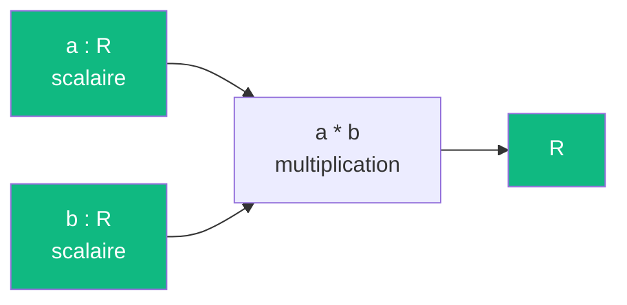
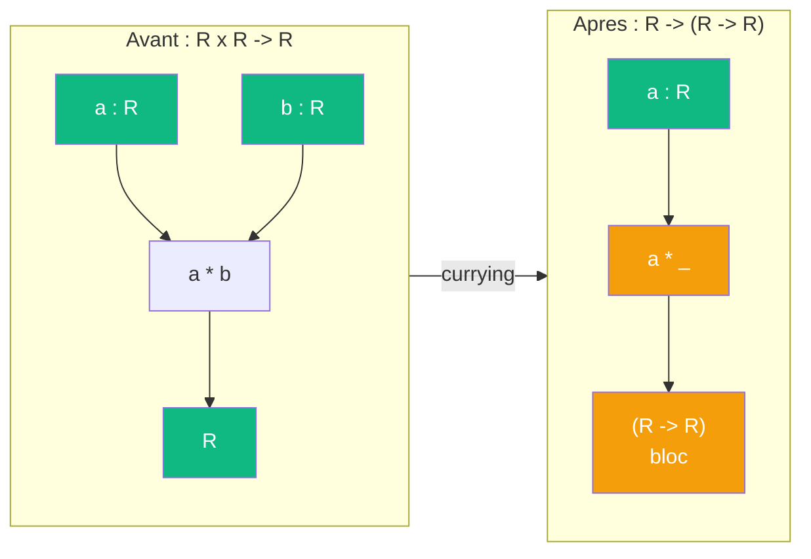

# Ponderer

> [Retour aux sens](README.md)

`a * b`

- **Sens** -- peser une grandeur par une autre
- **Contrat** -- `R x R -> R` (symetrique)
- **Ports** -- `a in R`, `b in R` (entrees), `R` (sortie)
- **Cablage** -- `a, b -> a*b -> R`

## Comment ca marche

Le produit lineaire est le cablage le plus elementaire : deux scalaires entrent, leur produit sort. C'est la brique de **ponderation** — multiplier une grandeur par un poids.

## Currying du produit lineaire

Le [currying](../meta-objets/currying.md) transforme le produit lineaire en un bloc qui **produit un scalaire** :

| | Avant | Apres |
|---|---|---|
| **Contrat** | `R x R -> R` | `R -> (R -> R)` |
| **Entrees** | `a : R`, `b : R` | `a : R` |
| **Sortie** | `R` | bloc `(R -> R)` |

Le bloc `a * _` est une **forme lineaire sur R** : il attend un scalaire et en produit un.

Dans l'[exemple de la sphere](../cablages/projeter.md), fixer `a = 1/d^2` donne le bloc `(1/d^2) * _` -- un attenuateur qui pondere l'aire geometrique par la distance.

## Currying + Godel

TODO -- le produit lineaire currie comme amplificateur dans l'encodage de Godel ; lien avec la table de mixage d'[ecouter](../cablages/ecouter.md).

---

[← Observer](observer.md) | [Attirer →](attirer.md)
