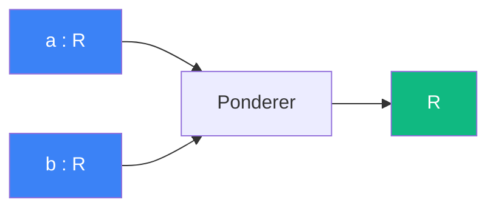

# Ponderer

> [Retour aux sens](../README.md)

`a * b`

- **Sens** -- peser une grandeur par une autre
- **Contrat** -- `R x R -> R` (symetrique)
- **Ports** -- `a in R`, `b in R` (entrees), `R` (sortie)

## Comment ca marche

Le produit lineaire est le cablage le plus elementaire : deux scalaires entrent, leur produit sort. C'est la brique de **ponderation** — multiplier une grandeur par un poids.

## Cablages

### Projeter
[observer/projeter.md](../observer/projeter.md)

- `a=aire, b=1/d²` → attenuation par distance

### Ecouter
[concentrer/ecouter.md](../concentrer/ecouter.md)

- `a=w_epsilon(x), b=f(x)` → ponderation ponctuelle

### Rencontrer
[aligner/rencontrer.md](../aligner/rencontrer.md)

- `a=t, b=v_i` → avancement
- `a=num, b=1/denom` → division

### Rencontrer Accelere
[equilibrer/rencontrer-accelere.md](../equilibrer/rencontrer-accelere.md)

- memes roles + termes quadratiques

### Viser
[equilibrer/viser.md](../equilibrer/viser.md)

- ponderation dans le tir balistique

### Quotient normalise
[comparer/quotient-normalise.md](../comparer/quotient-normalise.md)

- `a=||v||, b=||w||` → produit des normes (denominateur)

### Triple ponderation
[accelerer/triple-ponderation.md](../accelerer/triple-ponderation.md)

- `a=1/2, b=a, c=t²` → 3 multiplications en chaine

### Resolution cubique
[equilibrer/resolution-cubique.md](../equilibrer/resolution-cubique.md)

- coefficients du polynome

### Produit d'Euler
[sonder/produit-euler.md](../sonder/produit-euler.md)

- `a=1/(1-p^-s)` → facteurs du produit

---

[← Observer](../observer/) | [Attirer →](../attirer/)
