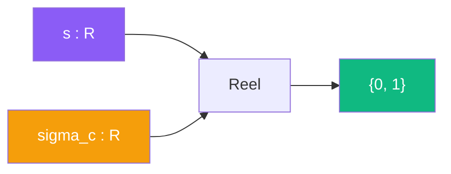

# Reel

> [Retour aux sens](../README.md)

`reel(s) = 1 si s > sigma_c, 0 sinon`

- **Sens** -- juger si un parametre d'ouverture est dans la zone convergente
- **Contrat** -- `R -> R` (vers {0, 1})
- **Ports** -- `s in R` en entree ; `R` en sortie

## Comment ca marche

Reel est un **jugement**. Il consomme le parametre `s` et dit si on est dans la zone reelle (convergence) ou irreelle (divergence).

Deux zones :
- `s > sigma_c` : le produit d'Euler converge, la valeur de [sonder](../sonder/) est finie -- zone **reelle**
- `s <= sigma_c` : le produit diverge, il faut un prolongement analytique -- zone **irreelle**

---

[<- Sonder](../sonder/) | [Frontiere ->](../../meta-sens/frontiere.md)
