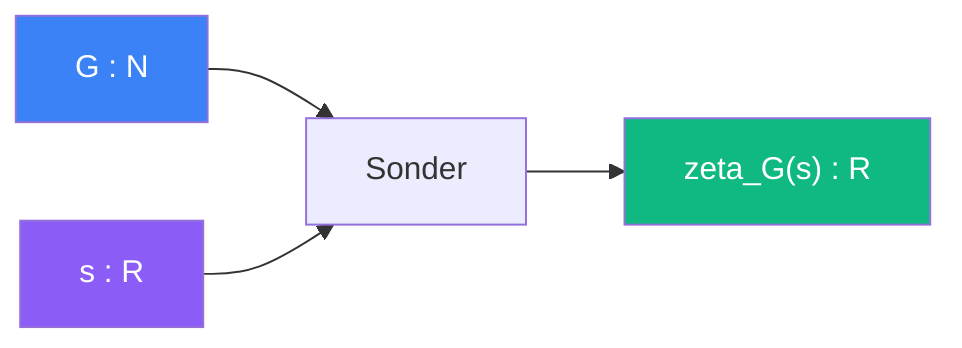

# Sonder

> [Retour aux sens](../README.md)

`zeta_G(s) = PI_{p_i | G} 1/(1 - p_i^{-s})`

- **Sens** -- evaluer la fonction zeta sur un encodage
- **Contrat** -- `N x R -> R` (asymetrique)
- **Ports** -- `G in N` (nombre de Godel), `s in R` (ouverture) en entree ; `R` en sortie

## Composition avec Reel et Frontiere

```
G --> [Frontiere] --> sigma_c --> [Reel] --> {0,1}
|                                  ^
|                                  |
+--> [Sonder] --> zeta_G(s)        s
       ^
       s
```

[Frontiere](../../meta-sens/frontiere.md) donne le seuil `sigma_c`, Sonder calcule la valeur, [Reel](../reel/) juge la convergence.

## Comment ca marche



## Cablages

### Produit d'Euler
[sonder/produit-euler.md](produit-euler.md)

- `G=encodage, s=ouverture` → `zeta_G(s)`

---

[<- Comparer](../comparer/) | [Reel ->](../reel/)
