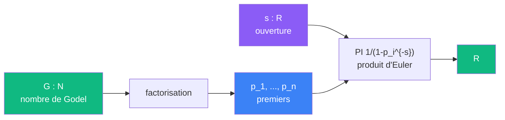

# Sonder -- cablage

> [Retour au sens Sonder](README.md)

## Comment ca marche

Sonder est le calcul brut. Il prend un circuit [encode par Godel](../../meta-objets/encodage.md) et un parametre d'ouverture `s`, et produit la valeur du produit d'Euler partiel.

La factorisation de `G` donne les premiers `p_1, ..., p_n`. Chaque premier contribue un facteur `1/(1 - p_i^{-s})`. Le produit de ces facteurs est `zeta_G(s)`.

Chaque facteur `1/(1-p_i^{-s})` est une [ponderation](../ponderer/) : il pese la contribution du premier `p_i` selon l'ouverture `s`.

## Triple distinction

| Dimension | Sonder |
|-----------|--------|
| **Sens** | evaluer la fonction zeta sur un encodage |
| **Contrat** | `N x R -> R` |
| **Cablage** | factorisation -> produit d'Euler partiel |
