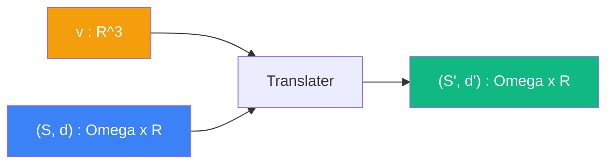

# Translater

> [Retour aux sens](../README.md)

`T_v(_)`

- **Sens** -- appliquer un deplacement fixe a toute sphere
- **Contrat** -- `(Omega x R) -> (Omega x R)`
- **Ports** -- `(S, d) in Omega x R` en entree ; `(S', d') in Omega x R` en sortie
- **Origine** -- [currying](../../meta-objets/currying.md) de [deplacer](../deplacer/), entree `v` fixee

## Comment ca marche

Le bloc `T_v(_)` est un **operateur de translation** : il attend une sphere avec sa distance et produit la sphere translatee. C'est le resultat du [currying](../../meta-objets/currying.md) de [deplacer](../deplacer/) quand on fixe le vecteur `v`.

Composer plusieurs `T_v` revient a additionner les vecteurs de deplacement.

| | Deplacer | Translater |
|---|---|---|
| **Contrat** | `R^3 x (Omega x R) -> (Omega x R)` | `(Omega x R) -> (Omega x R)` |
| **Entrees** | `v : R^3`, `(S, d) : Omega x R` | `(S, d) : Omega x R` |
| **Sortie** | `(S', d') : Omega x R` | `(S', d') : Omega x R` |

---

[← Champ](../champ/) | [Lire →](../lire/)
