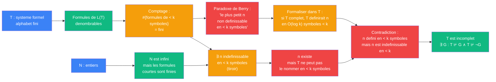

# Godel — cablage Boolos (paradoxe de Berry, 1989)

> [Retour a Godel](../README.md)

## Le probleme

Formaliser le paradoxe de Berry — "le plus petit entier non definissable en moins de k symboles" — pour en deduire l'incompletude de T.

## Circuit

## Role de chaque bloc

| Etape | Bloc | Contrat | Sens dans ce contexte |
|-------|------|---------|----------------------|
| 1 | Formules de L(T) | `alphabet -> L(T)` | le langage de T sur un alphabet fini |
| 2 | Comptage | `N -> N` | nombre de formules de longueur < k — c'est fini |
| 3 | Principe du tiroir | `fini vs infini` | N infini, formules courtes finies => certains n ne sont pas definissables |
| 4 | Paradoxe de Berry | `L(T)` | "le plus petit n non definissable en < k symboles" — phrase auto-referente |
| 5 | Formalisation | `T complet -> definition courte` | si T est complet, il pourrait definir n en O(log k) symboles |
| 6 | Contradiction | | n serait definissable et indefinissable en < k symboles |
| 7 | Conclusion | | T est incomplet — il ne peut pas definir tous les entiers |

## Axiomes mobilises

| Code | Role | Type |
|------|------|------|
| COH | T est coherent (T ⊬ ⊥) | structurel |
| FIN | l'alphabet de T est fini | structurel |
| DEN | les formules de L(T) sont denombrables | structurel |
| LEX | borne lexicale — le nombre de formules de longueur < k est fini (|alphabet|^k) | numerique |
| COMP | comptage des definitions — principe du tiroir applique aux formules et aux entiers | numerique |

## Triple distinction

| Dimension | Boolos |
|-----------|--------|
| **Sens** | un langage fini ne peut pas nommer tous les entiers — le paradoxe de Berry revele les limites expressives de T |
| **Contrat** | `T (coherent, ⊇ PA) -> ∃ G : T ⊬ G ∧ T ⊬ ¬G` |
| **Cablage** | alphabet fini → formules denombrables → comptage → tiroir → ∃ n indefinissable → Berry formalise → contradiction → incompletude |
