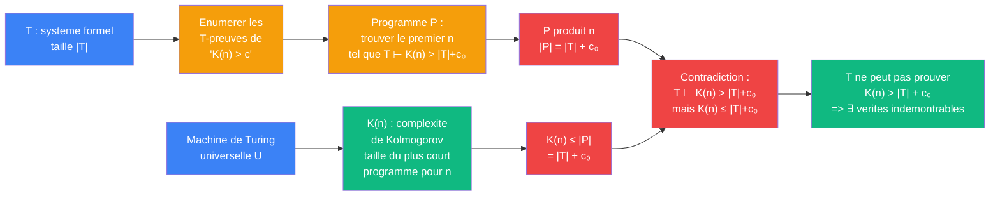

# Godel — cablage Chaitin (complexite de Kolmogorov, 1971)

> [Retour a Godel](../README.md)

## Le probleme

Montrer qu'un systeme formel T ne peut pas prouver qu'un nombre a une complexite de Kolmogorov superieure a la taille de T lui-meme. Il existe donc des verites sur la complexite que T ne peut pas demontrer.

## Circuit

## Role de chaque bloc

| Etape | Bloc | Contrat | Sens dans ce contexte |
|-------|------|---------|----------------------|
| 1 | Machine universelle | axiome | U definit la complexite K(n) |
| 2 | K(n) | `N -> N` | taille du plus court programme qui produit n |
| 3 | Enumeration des preuves | `T -> suite de theoremes` | lister les phrases de la forme "K(n) > c" prouvees par T |
| 4 | Programme P | `N -> N` | chercher et produire le premier n tel que T ⊢ K(n) > |T|+c₀ |
| 5 | Borne sur K(n) | `inegalite` | K(n) ≤ |P| = |T| + c₀ car P est un programme qui produit n |
| 6 | Contradiction | | T affirme K(n) > |T|+c₀ mais K(n) ≤ |T|+c₀ |
| 7 | Conclusion | | T ne peut pas prouver des bornes K(n) au-dela de sa propre taille |

## Axiomes mobilises

| Code | Role | Type |
|------|------|------|
| COH | T est coherent (T ⊬ ⊥) | structurel |
| UTM | machine de Turing universelle — K(n) est bien definie | structurel |
| KOLM | K(n) = min{|p| : U(p) = n} — complexite de Kolmogorov | structurel |
| BORNE | K(n) ≤ |programme qui produit n| — propriete fondamentale de K | numerique |
| OMEGA | incompressibilite — il existe des n avec K(n) arbitrairement grand | numerique |

## Triple distinction

| Dimension | Chaitin |
|-----------|---------|
| **Sens** | un systeme formel a une capacite informationnelle finie — il ne peut pas capturer toute la complexite des entiers |
| **Contrat** | `T (coherent, ⊇ PA) -> ∃ G : T ⊬ G ∧ T ⊬ ¬G` |
| **Cablage** | definir K(n) → construire P qui cherche n avec K(n) > |T| → |P| borne K(n) → contradiction → incompletude |

## Lien avec Frontiere

Ce cablage partage la meme logique de **seuil** que [Frontiere](../../../meta-sens/frontiere.md) : il existe une borne (ici |T| + c₀) au-dela de laquelle le systeme ne peut plus atteindre. La frontiere de T est sa propre taille informationnelle.
