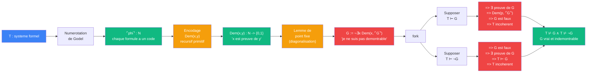

# Godel — cablage original (auto-reference, 1931)

> [Retour a Godel](../README.md)

## Le probleme

Construire une phrase G du langage de T qui dit "je ne suis pas demontrable dans T", puis montrer que G est vraie et indemontrable.

## Circuit

## Role de chaque bloc

| Etape | Bloc | Contrat | Sens dans ce contexte |
|-------|------|---------|----------------------|
| 1 | Numerotation de Godel | `L(T) -> N` | chaque formule, preuve, symbole recoit un entier unique |
| 2 | Encodage de Dem(x,y) | `N x N -> {0,1}` | "x est le code d'une preuve de la formule de code y" |
| 3 | Lemme de point fixe | `(N -> L(T)) -> L(T)` | construire G telle que G <=> ¬∃x Dem(x, ⌜G⌝) |
| 4 | fork | `L(T) -> L(T) x L(T)` | examiner les deux hypotheses (T ⊢ G et T ⊢ ¬G) |
| 5 | Contradiction | `hypothese -> ⊥` | chaque branche contredit la coherence de T |
| 6 | Conclusion | | T ⊬ G ∧ T ⊬ ¬G — G est vrai et indemontrable |

## Axiomes mobilises

| Code | Role | Type |
|------|------|------|
| COH | T est coherent (T ⊬ ⊥) | structurel |
| PA | T contient l'arithmetique de Peano | structurel |
| INJ | la numerotation est injective (chaque formule a un code unique) | structurel |
| REC | Dem(x,y) est recursive primitive — T peut parler de ses propres preuves | numerique |
| FIX | lemme de point fixe (diagonalisation) — ∀ F, ∃ G : G <=> F(⌜G⌝) | numerique |

## Triple distinction

| Dimension | Godel original |
|-----------|----------------|
| **Sens** | un systeme formel assez riche peut parler de lui-meme, et cette auto-reference produit une phrase vraie mais indemontrable |
| **Contrat** | `T (coherent, ⊇ PA) -> ∃ G : T ⊬ G ∧ T ⊬ ¬G` |
| **Cablage** | numerotation → encodage Dem → point fixe → auto-reference → contradiction des deux hypotheses |

## Blocs reutilises

| Bloc | Occurrences | Role |
|------|-------------|------|
| [Encodage](../../../meta-objets/encodage.md) | x1 | numerotation de Godel — injecter les formules dans N |
