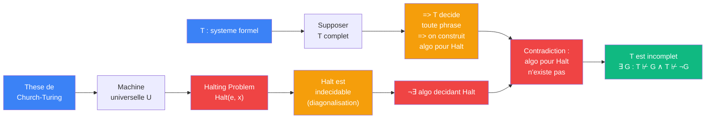

# Godel — cablage Kleene (calculabilite, 1943)

> [Retour a Godel](../README.md)

## Le probleme

Deduire l'incompletude de T de l'indecidabilite du probleme de l'arret : si T etait complet, on pourrait decider le halting problem, ce qui est impossible.

## Circuit

## Role de chaque bloc

| Etape | Bloc | Contrat | Sens dans ce contexte |
|-------|------|---------|----------------------|
| 1 | These de Church-Turing | axiome | les fonctions calculables = les fonctions Turing-calculables |
| 2 | Machine universelle | `N x N -> N` | U(e, x) simule la machine e sur l'entree x |
| 3 | Halting Problem | `N x N -> {0,1}` | "la machine e s'arrete-t-elle sur x ?" |
| 4 | Indecidabilite de Halt | `demonstration` | par diagonalisation, aucun algorithme ne decide Halt |
| 5 | Reduction | `T complet => algo Halt` | si T decide toute phrase, enumerer les preuves decide Halt |
| 6 | Contradiction | | algo Halt impossible => T ne decide pas toute phrase |

## Axiomes mobilises

| Code | Role | Type |
|------|------|------|
| COH | T est coherent (T ⊬ ⊥) | structurel |
| PA | T contient l'arithmetique de Peano | structurel |
| CT | these de Church-Turing — tout calcul effectif est Turing-calculable | structurel |
| SIM | simulation universelle — U(e, x) simule toute machine | numerique |
| RED | reduction : si T complet, enumerer les T-preuves decide Halt(e, x) | numerique |

## Triple distinction

| Dimension | Kleene |
|-----------|--------|
| **Sens** | l'incompletude est une consequence de l'indecidabilite du halting problem — un systeme complet donnerait trop de pouvoir calculatoire |
| **Contrat** | `T (coherent, ⊇ PA) -> ∃ G : T ⊬ G ∧ T ⊬ ¬G` |
| **Cablage** | these de Church-Turing → machine universelle → Halt indecidable → reduction completude-vers-Halt → contradiction |

## Blocs reutilises

| Bloc | Occurrences | Role |
|------|-------------|------|
| [Encodage](../../../meta-objets/encodage.md) | x1 | encoder les machines et entrees comme entiers |
| [Sonder](../../sonder/) | x1 | tester si une machine s'arrete — la question que T ne peut pas trancher |
