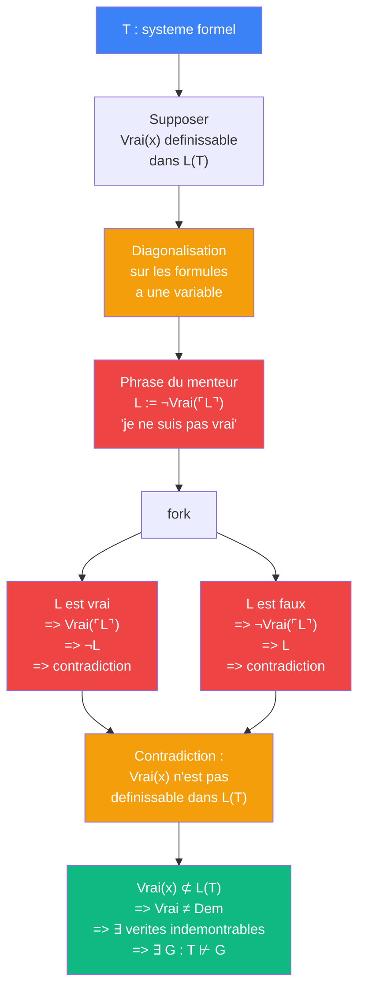

# Godel — cablage Tarski (indefinissabilite de la verite)

> [Retour a Godel](../README.md)

## Le probleme

Montrer que la verite arithmetique n'est pas definissable dans l'arithmetique elle-meme, puis en deduire que certaines verites echappent a la demontrabilite.

## Circuit

## Role de chaque bloc

| Etape | Bloc | Contrat | Sens dans ce contexte |
|-------|------|---------|----------------------|
| 1 | Hypothese | axiome temporaire | supposer que Vrai(x) est une formule de L(T) |
| 2 | Diagonalisation | `L(T) -> L(T)` | construire L qui parle de sa propre verite |
| 3 | Phrase du menteur | `L(T)` | L := ¬Vrai(⌜L⌝) — auto-reference semantique |
| 4 | fork | `L(T) -> L(T) x L(T)` | examiner les deux cas (L vrai / L faux) |
| 5 | Contradiction | `hypothese -> ⊥` | les deux cas menent a une contradiction |
| 6 | Conclusion | | Vrai(x) n'est pas definissable => verite ≠ demontrabilite => incompletude |

## Axiomes mobilises

| Code | Role | Type |
|------|------|------|
| COH | T est coherent (T ⊬ ⊥) | structurel |
| PA | T contient l'arithmetique de Peano | structurel |
| DEN | le langage L(T) est denombrable | structurel |
| DIAG | diagonalisation sur les formules a une variable — meme mecanisme que le point fixe de Godel | numerique |

## Triple distinction

| Dimension | Tarski |
|-----------|--------|
| **Sens** | la verite depasse la demontrabilite — un systeme formel ne peut pas definir sa propre notion de verite |
| **Contrat** | `T (coherent, ⊇ PA) -> ∃ G : T ⊬ G ∧ T ⊬ ¬G` |
| **Cablage** | supposer Vrai(x) definissable → diagonaliser → phrase du menteur → contradiction → verite ≠ preuve → incompletude |
