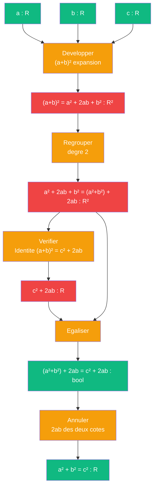

# Pythagore — cablage algebrique

> [Retour a Pythagore](../README.md)

## Le probleme

Montrer que `a² + b² = c²` par manipulation d'identites algebriques pures, sans passer par la geometrie. Le cablage developpe `(a+b)²` et extraire l'invariant en annulant le terme croise `2ab`.

## La demarche

```
(a+b)² = a² + 2ab + b²                    [developper le carre du binome]
       = (a² + b²) + 2ab                   [regrouper les termes de degre 2]

Or, si c² + 2ab = (a+b)², alors :
       c² = a² + b²                         [isoler les termes de degre 2]
```

L'identite `(a+b)² = c² + 2ab` est verifiee geometriquement (grand carre = carre central + 4 triangles), mais le passage algebrique montre que **Pythagore est une simple rearrangement de termes**.

## Circuit



## Role de chaque bloc

| Etape | Bloc | Contrat | Sens dans ce contexte |
|-------|------|---------|----------------------|
| 1 | Developper binome | `R x R -> R²` | `(a+b)² = a² + 2ab + b²` |
| 2 | Regrouper | `R² -> R²` | `a² + 2ab + b² = (a²+b²) + 2ab` |
| 3 | Verifier identite | `R -> bool` | `(a+b)² = c² + 2ab` (pose comme axiome) |
| 4 | Egaliser | `R² x R² -> bool` | `(a²+b²) + 2ab = c² + 2ab` |
| 5 | Annuler | `bool -> R` | soustraire `2ab` des deux cotes → `a² + b² = c²` |

## Axiomes mobilises

| Code | Role | Type |
|------|------|------|
| A1 | identite du binome : `(a+b)² = a² + 2ab + b²` | structurel |
| A2 | commutativite de l'addition | structurel |
| A3 | associativite de l'addition | structurel |
| A4 | propriete : `x + y = z + y  =>  x = z` (annulation) | structurel |
| N1 | identite geometrique : `(a+b)² = c² + 2ab` (posee) | numerique |
| N2 | egalite des deux formes du developpement | numerique |

## Triple distinction

| Dimension | Pythagore algebrique |
|-----------|---------------------|
| **Sens** | l'hypotenuse se deduit des deux cotes par rearrangement d'identites algebriques |
| **Contrat** | `R x R -> R` (entrees : a, b ; sortie : c) |
| **Cablage** | developper (a+b)² + regrouper terms + verifier identite + annuler 2ab |

## Blocs reutilises

| Bloc | Occurrences | Role |
|------|-------------|------|
| [Ponderer](../../../ponderer/) | x3 | développer binome (a+b)², grouper, annuler 2ab |
| [Aligner](../../../observer/aligner.md) | x1 | verifier l'egalite entre deux formes du developpement |

## Lien avec Euclide

| Aspect | Euclide | Algebre |
|--------|---------|---------|
| **Domaine** | Geometrie (Omega) | Polynomes (R[a,b,c]) |
| **Processus** | decoupage physique + calcul d'aires | manipulation symbolique |
| **Identite clef** | `(a+b)² = 4·½ab + c²` | `(a+b)² = a² + 2ab + b²` |
| **Conclusion** | lire l'egalite des aires | annuler le terme croise `2ab` |
| **Cout** | axiomes geometriques (P1-P5) | axiomes algebriques (A1-A4) |

Les deux cablages prouvent le meme fait (`a² + b² = c²`) mais depuis des univers distincts. Euclide montre pourquoi, Algebre montre comment.
