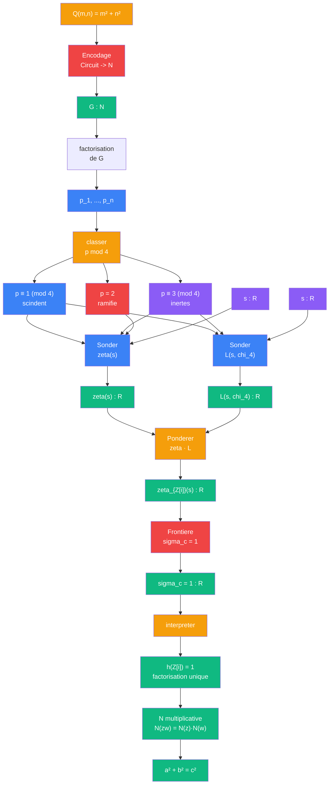
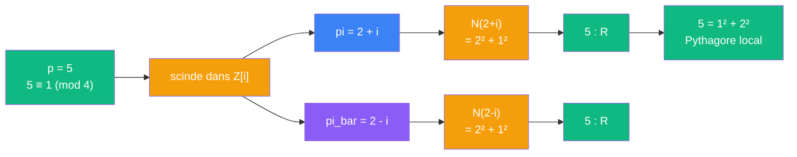

# Pythagore — cablage arithmetique

> [Retour a Pythagore](../README.md) | [Cablage Frontiere](frontiere.md)

## Le probleme

Quels nombres sont sommes de deux carres ? La reponse passe par la factorisation de la zeta d'Epstein `zeta_Q(s)` en `zeta(s) · L(s, chi_4)`. Les premiers qui "voient" la forme pythagoricienne sont exactement ceux congrus a 1 mod 4. Cette factorisation relie la geometrie (la norme `a² + b²`) a l'arithmetique (la distribution des premiers).

## Le pont : entiers de Gauss

L'anneau `Z[i] = {a + bi : a, b ∈ Z}` est le pont entre les deux mondes. La **norme** d'un entier de Gauss est :

```
N(a + bi) = a² + b²
```

C'est la forme pythagoricienne. La question "Pythagore tient-il ?" devient "la norme sur Z[i] est-elle multiplicative ?", c'est-a-dire `N(z·w) = N(z)·N(w)`.

La reponse depend de la **factorisation unique** dans Z[i]. Si Z[i] est factoriel (classe number h = 1), alors la norme est multiplicative, et Pythagore tient.

## La factorisation de la zeta

La zeta de Dedekind de Z[i] se factorise :

```
zeta_{Z[i]}(s) = zeta(s) · L(s, chi_4)
```

ou `chi_4` est le caractere de Dirichlet mod 4 :

```
chi_4(p) =  +1   si  p ≡ 1 (mod 4)
chi_4(p) =  -1   si  p ≡ 3 (mod 4)
chi_4(p) =   0   si  p = 2
```

Chaque premier rationnel se comporte differemment dans Z[i] :

| Premier p | p mod 4 | Comportement dans Z[i] | Facteur d'Euler | Somme de 2 carres ? |
|-----------|---------|------------------------|-----------------|---------------------|
| 2 | — | ramifie : `2 = -i(1+i)²` | `1/(1-2^{-s})` | oui : `1² + 1²` |
| 5 | 1 | scinde : `5 = (2+i)(2-i)` | `1/(1-5^{-s})²` | oui : `1² + 2²` |
| 13 | 1 | scinde : `13 = (3+2i)(3-2i)` | `1/(1-13^{-s})²` | oui : `2² + 3²` |
| 3 | 3 | inerte : `3` reste premier | `1/(1-3^{-2s})` | non |
| 7 | 3 | inerte : `7` reste premier | `1/(1-7^{-2s})` | non |

## Circuit



## Role de chaque bloc

| Etape | Bloc | Contrat | Sens dans ce contexte |
|-------|------|---------|----------------------|
| 1 | [Encodage](../../../../meta-objets/encodage.md) | `Circuit -> N` | encoder la forme Q comme nombre de Godel |
| 2 | Factorisation | `N -> (N)_n` | extraire les premiers de G |
| 3 | Classer mod 4 | `N -> {scinde, inerte, ramifie}` | trier les premiers selon leur comportement dans Z[i] |
| 4 | [Sonder](../../../sonder/) x2 | `N x R -> R` | produit d'Euler pour zeta(s) et L(s, chi_4) separement |
| 5 | [Ponderer](../../../ponderer/) | `R x R -> R` | multiplier : zeta_{Z[i]} = zeta · L |
| 6 | [Frontiere](../../../../meta-sens/frontiere.md) | `N -> R` | sigma_c = 1 |
| 7 | Interpreter | `R -> prop` | sigma_c = 1 → h = 1 → norme multiplicative → Pythagore |

## La chaine logique

```
sigma_c(zeta_{Z[i]}) = 1
    │
    ↓  le residu en s = 1 encode le nombre de classes
h(Z[i]) = 1
    │
    ↓  classe number 1 = factorisation unique
Z[i] est factoriel
    │
    ↓  dans un anneau factoriel, la norme est multiplicative
N(z · w) = N(z) · N(w)
    │
    ↓  N(a + bi) = a² + b²
a² + b² = c²  quand  c = |z|
```

## Exemple : 5 = 1² + 2²



5 scinde parce que `chi_4(5) = +1`. Le facteur d'Euler de 5 dans L(s, chi_4) est `1/(1 - 5^{-s})`, et dans zeta_{Z[i]} il contribue `1/(1 - 5^{-s})²` — le carre temoigne de la scission en deux facteurs conjugues.

## Contre-exemple : 3 n'est pas somme de deux carres

```
p = 3,  3 ≡ 3 (mod 4),  chi_4(3) = -1
3 reste inerte dans Z[i] (ne scinde pas)
Le facteur d'Euler est 1/(1 - 3^{-2s}) — pas de carre
Pas de decomposition 3 = a² + b² possible
```

## Theoreme de Fermat (1640)

Le circuit entier donne une preuve du theoreme de Fermat sur les sommes de deux carres :

> Un premier impair `p` est somme de deux carres ssi `p ≡ 1 (mod 4)`.

C'est la lecture arithmetique de Pythagore : les premiers qui "voient" la forme `a² + b²` sont exactement ceux pour lesquels le facteur d'Euler scinde dans la zeta de Dedekind de Z[i].

## Triple distinction

| Dimension | Pythagore arithmetique |
|-----------|------------------------|
| **Sens** | les nombres qui sont sommes de deux carres sont determines par leur classe mod 4 |
| **Contrat** | `N x R -> R` (premiers x ouverture → zeta) |
| **Cablage** | Encodage + classer mod 4 + Sonder x2 (zeta et L) + Ponderer + Frontiere |

## Blocs reutilises

| Bloc | Occurrences | Role |
|------|-------------|------|
| [Sonder](../../../sonder/) | x2 | zeta(s) et L(s, chi_4) separement |
| [Ponderer](../../../ponderer/) | x1 | multiplier zeta · L |
| [Frontiere](../../../../meta-sens/frontiere.md) | x1 | sigma_c = 1 → factorisation unique |
| [Encodage](../../../../meta-objets/encodage.md) | x1 | forme Q → nombre de Godel |
