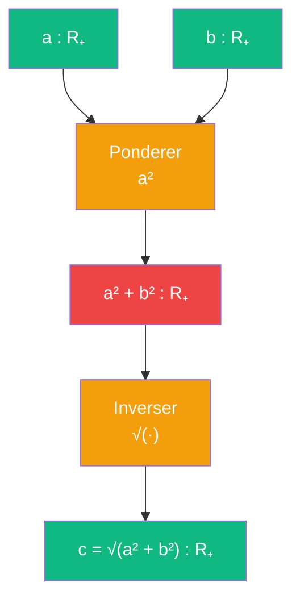

# Pythagore — cablage algebrique derive (currying)

> [Retour a Pythagore](../README.md) | [Cablage Algebre](../algebre.md) | [Meta-objet Currying](../../../../meta-objets/currying.md)

## Le probleme

Trouver `c` a partir de `(a, b)` en inversant l'identite algebrique `a² + b² = c²`. Le cablage Algebre verifie l'egalite ; ce cablage **calcule** la valeur manquante par isolation algebrique.

## Le currying

Le cablage Algebre a le contrat :
```
(a, b, c) ∈ R₊³  -->  vérifier : a² + b² = c²
```

En appliquant le **currying** (fixer deux entrees pour produire une fonction en la troisieme) :
```
Avant:  (a, b, c) ∈ R³  -->  bool
Apres:  (a, b) ∈ R₊²  -->  c ∈ R₊    [inverser c]
```

On passe d'une **vérification** a un **calcul**.

## Circuit



## Role de chaque bloc

| Etape | Bloc | Contrat | Sens dans ce contexte |
|-------|------|---------|----------------------|
| 1 | Ponderer | `R₊ x R₊ -> R₊` | calculer `a²` et `b²` |
| 2 | Additionner | `R₊ x R₊ -> R₊` | `a² + b²` |
| 3 | Inverser (racine) | `R₊ -> R₊` | `c = √(a² + b²)` |

## Axiomes mobilises

| Code | Role | Type |
|------|------|------|
| A1 | identite du binome (reference) | structurel |
| A4 | propriete : `x² = y  <==>  x = √y` (inversion) | structurel |
| N3 | calcul numerique des carres | numerique |
| N4 | calcul numerique de la racine | numerique |

## Triple distinction

| Dimension | Pythagore algebrique inverse |
|-----------|------------------------------|
| **Sens** | l'hypotenuse se **calcule** des deux autres cotes par isolation algebrique |
| **Contrat** | `R₊ x R₊ -> R₊` (entrees : a, b ; sortie : c) |
| **Cablage** | calculer a² et b² + additionner + prendre la racine carree |

## Difference avec Algebre

| Aspect | Algebre | Algebre Inverse |
|--------|---------|-----------------|
| **Question** | "Est-ce que a² + b² = c² ?" | "Quel est c tel que a² + b² = c² ?" |
| **Processus** | vérification d'une identité | isolation d'une variable |
| **Contrat** | `R³ -> bool` | `R² -> R` |
| **Cout** | 2 multiplications + 1 addition | 2 multiplications + 1 addition + 1 racine |
| **Port manquant** | c (connu) | c (cherche) |

Le currying **change la topologie** : une entree devient une sortie. L'identite algebrique reste la meme, mais sa **direction d'usage** s'inverse.

## Lien avec le meta-objet Currying

Ce cablage est une application directe du [meta-objet Currying](../../../../meta-objets/currying.md) :

```
Sens source:   Algebre (R³ -> bool, verification)
Entree fixee:  les deux ports a, b deviennent constantes
Sens currie:   Algebre Inverse (R² -> R, calcul)
```

En fixant `a` et `b` dans la relation `a² + b² = c²`, on produit une **fonction** qui prend n'importe quel couple `(a, b)` et retourne `c = √(a² + b²)`.

## Axiomes du currying

Le currying introduit une **rupture de symetrie** :
- L'identite algebrique est **symetrique** en a, b, c
- Le currying **choisit** une direction : c est la sortie, a et b sont les entrees
- Cette direction est semantique, pas syntaxique — c'est une **interpretation**

