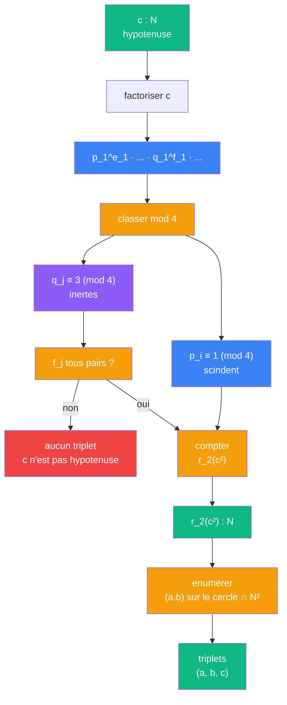
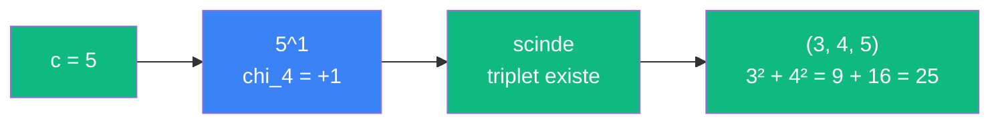
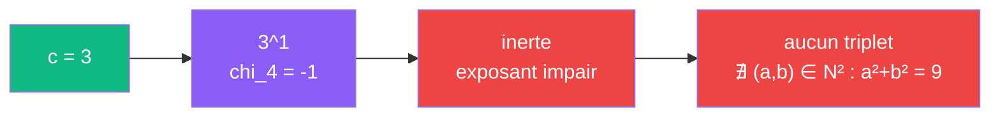

# Pythagore — cablage entier (triplets pythagoriciens)

> [Retour a Pythagore](../README.md) | [Cablage arithmetique](arithmetique.md)

## Le probleme

On connait l'hypotenuse `c ∈ N`. Existe-t-il `(a, b) ∈ N² ∩ R_+²` tels que `a² + b² = c²` ? Combien y en a-t-il ?

Le passage de R_+ a N contraint le cercle continu `a² + b² = c²` a un ensemble fini de points du reseau. Le [cablage arithmetique](arithmetique.md) donne le critere exact : la factorisation de `c` dans Z[i] et le caractere `chi_4` determinent tout.

## Contrainte

```
domaine continu :  (a, b) ∈ R_+²   →  cercle (infini de points)
domaine entier  :  (a, b) ∈ N²     →  points du reseau sur le cercle (fini, souvent 0)
```

La contrainte `N²` est un **filtre arithmetique** : elle ne garde que les points du reseau Z[i] qui tombent exactement sur le cercle.

## Le critere chi_4

Un premier `p` est somme de deux carres ssi il scinde dans Z[i], c'est-a-dire ssi `chi_4(p) = +1`.

| Premier p | p mod 4 | chi_4(p) | Scinde ? | Somme de 2 carres ? |
|-----------|---------|----------|----------|---------------------|
| 2 | 2 | 0 | ramifie | oui : `1² + 1²` |
| 5 | 1 | +1 | scinde | oui : `1² + 2²` |
| 13 | 1 | +1 | scinde | oui : `2² + 3²` |
| 17 | 1 | +1 | scinde | oui : `1² + 4²` |
| 29 | 1 | +1 | scinde | oui : `2² + 5²` |
| 3 | 3 | -1 | inerte | non |
| 7 | 3 | -1 | inerte | non |
| 11 | 3 | -1 | inerte | non |

## Regle de decomposition de c

Pour `c ∈ N`, factoriser `c = 2^e_0 · p_1^e_1 · ... · q_1^f_1 · ...` ou les `p_i ≡ 1 (mod 4)` et les `q_j ≡ 3 (mod 4)`.

| Condition | Verdict |
|-----------|---------|
| un `q_j` apparait a puissance **impaire** dans `c` | `c` n'est hypotenuse d'**aucun** triplet |
| tous les `q_j` a puissance **paire** dans `c` | `c` est hypotenuse, le nombre de triplets depend des `e_i` |

Le nombre de representations `r_2(c²)` (avec signes et permutations) est :

```
r_2(c²) = 4 · SUM_{d | c²} chi_4(d)
```

## Circuit



## Role de chaque bloc

| Etape | Bloc | Contrat | Sens dans ce contexte |
|-------|------|---------|----------------------|
| 1 | Factoriser | `N -> (N x N)_n` | decomposer c en premiers avec exposants |
| 2 | Classer mod 4 | `N -> {scinde, inerte}` | trier chaque premier par chi_4 |
| 3 | Tester parite | `N -> {oui, non}` | les exposants des inertes sont-ils tous pairs ? |
| 4 | Compter r_2 | `N -> N` | nombre de representations via `4 · SUM chi_4(d)` |
| 5 | Enumerer | `N -> (N x N)_k` | lister les paires (a, b) sur le cercle |

## Exemples

### c = 5 (scinde)

```
5 ≡ 1 (mod 4)  →  chi_4(5) = +1  →  scinde : 5 = (2+i)(2-i)
c² = 25  →  r_2(25) = 12 (avec signes)  →  triplets en N_+² : (3, 4, 5)
```



### c = 25 (scinde, multiple)

```
25 = 5²  →  5 ≡ 1 (mod 4)  →  chi_4(5) = +1
c² = 625  →  triplets en N_+² : (7, 24, 25), (15, 20, 25)
```

### c = 3 (inerte, pas de triplet)

```
3 ≡ 3 (mod 4)  →  chi_4(3) = -1  →  inerte
3^1 : exposant impair  →  aucun triplet
```



### c = 15 (mixte)

```
15 = 3 · 5
3 ≡ 3 (mod 4)  →  inerte, exposant 1 (impair)  →  aucun triplet
```

Malgre la presence de 5 (qui scinde), le facteur 3 a exposant impair bloque.

### c = 9 (inerte mais exposant pair)

```
9 = 3²
3 ≡ 3 (mod 4)  →  inerte, mais exposant 2 (pair)  →  triplet possible
c² = 81  →  (0, 9, 9) trivial uniquement — pas de triplet avec a, b > 0
```

Attention : exposant pair ne garantit pas un triplet **non trivial**. Il faut au moins un facteur qui scinde.

### c = 45 (mixte, triplet existe)

```
45 = 3² · 5
3² : inerte mais pair → ok
5^1 : scinde → ok
triplets : (27, 36, 45), (9, 36, 45) — existent grace au facteur 5
```

## La regle complete

> `c` est hypotenuse d'un triplet pythagoricien `(a, b, c)` avec `a, b > 0`
> ssi `c` a au moins un facteur premier `p ≡ 1 (mod 4)`.

C'est le theoreme de Fermat lu a travers le filtre `N² ∩ R_+²`.

## Scan des hypotenuses 1 a 25

| c | factorisation | chi_4 des premiers | triplets (a, b) avec a < b |
|---|---------------|--------------------|-----------------------------|
| 1 | 1 | — | aucun |
| 2 | 2 | ramifie | aucun |
| 3 | 3 | -1 | aucun |
| 4 | 2² | ramifie | aucun |
| **5** | **5** | **+1** | **(3, 4)** |
| 6 | 2·3 | -1 | aucun |
| 7 | 7 | -1 | aucun |
| 8 | 2³ | ramifie | aucun |
| 9 | 3² | -1 (pair) | aucun (pas de scinde) |
| **10** | **2·5** | **+1** | **(6, 8)** |
| 11 | 11 | -1 | aucun |
| 12 | 2²·3 | -1 | aucun |
| **13** | **13** | **+1** | **(5, 12)** |
| 14 | 2·7 | -1 | aucun |
| **15** | 3·5 | +1 et -1 | **(9, 12)** |
| 16 | 2⁴ | ramifie | aucun |
| **17** | **17** | **+1** | **(8, 15)** |
| 18 | 2·3² | -1 (pair) | aucun |
| 19 | 19 | -1 | aucun |
| **20** | **2²·5** | **+1** | **(12, 16)** |
| 21 | 3·7 | -1 | aucun |
| 22 | 2·11 | -1 | aucun |
| 23 | 23 | -1 | aucun |
| 24 | 2³·3 | -1 | aucun |
| **25** | **5²** | **+1** | **(7, 24), (15, 20)** |

Les lignes en gras sont les hypotenuses valides — celles qui ont au moins un facteur `p ≡ 1 (mod 4)`.

## Triple distinction

| Dimension | Pythagore entier |
|-----------|------------------|
| **Sens** | quels entiers sont hypotenuses de triplets pythagoriciens |
| **Contrat** | `N -> {(N x N)_k}` (hypotenuse → ensemble de paires) |
| **Cablage** | factoriser + classer mod 4 + tester parite + enumerer |

## Lien avec les autres cablages

| Cablage | Domaine | Question |
|---------|---------|----------|
| [Euclide](euclide.md) | `R_+²` (continu) | est-ce vrai pour (a, b) reels ? |
| [Mesure](mesure.md) | `R_+²` (continu) | les aires se conservent-elles ? |
| [Hilbert](hilbert.md) | `E` (continu) | les normes s'additionnent-elles pour v ⊥ w ? |
| [Frontiere](frontiere.md) | `N` (encodage) | pourquoi cette forme et pas une autre ? |
| [Arithmetique](arithmetique.md) | `N` (premiers) | quels premiers voient la forme ? |
| **Entiers** | **`N² ∩ R_+²`** (discret) | **quels entiers sont hypotenuses ?** |

Le cablage entier est le **filtre discret** applique au cercle continu. Il consomme le verdict de chi_4 (cablage arithmetique) et le transforme en une enumeration concrete.

## Blocs reutilises

| Bloc | Occurrences | Role |
|------|-------------|------|
| Factoriser | x1 | decomposer c en premiers |
| chi_4 | x1 par premier | classer scinde/inerte |
| r_2 | x1 | compter les representations |
