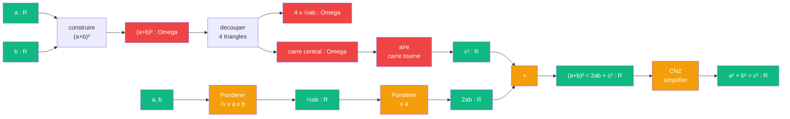

# Pythagore — cablage euclidien

> [Retour a Pythagore](../README.md)

## Le probleme

Montrer que `a² + b² = c²` en decoupant le grand carre `(a+b)²` en 4 triangles rectangles identiques et un carre central tourne de cote `c`. L'egalite des aires donne le resultat.

## Circuit

## Role de chaque bloc

| Etape | Bloc | Contrat | Sens dans ce contexte |
|-------|------|---------|----------------------|
| 1 | Construire carre | `R x R -> Omega` | figure geometrique de cote `(a+b)` |
| 2 | Decouper | `Omega -> Omega x Omega` | separe 4 triangles et carre central |
| 3 | [Ponderer](../../../ponderer/) | `R x R -> R` | aire d'un triangle `½ab` |
| 4 | [Ponderer](../../../ponderer/) | `R x R -> R` | multiplier par 4 |
| 5 | Aire carre tourne | `Omega -> R` | aire du carre central = `c²` |
| 6 | Additionner | `R x R -> R` | `2ab + c² = (a+b)²` |
| 7 | Simplifier (CN2) | `R -> R` | developper et annuler `2ab` des deux cotes |

## Axiomes mobilises

| Code | Role | Type |
|------|------|------|
| P1, P2 | tracer et prolonger les cotes du grand carre | structurel |
| P4 | les 4 triangles sont rectangles (aire = ½ab) | numerique |
| P5 | les paralleles ferment le carre central (aire = c²) | numerique |
| CN2 | additionner les aires : 4·½ab + c² = (a+b)² | numerique |
| CN4 | les 4 triangles sont congruents (meme aire) | numerique |
| CN1, CN5 | transitivite et structure du decoupage | structurel |

## Triple distinction

| Dimension | Pythagore euclidien |
|-----------|---------------------|
| **Sens** | l'hypotenuse se deduit des deux cotes par decoupage d'aires |
| **Contrat** | `R x R -> R` |
| **Cablage** | construire (a+b)² + decouper 4 triangles + isoler c² + simplifier |

## Blocs reutilises

| Bloc | Occurrences | Role |
|------|-------------|------|
| [Ponderer](../../../ponderer/) | x2 | aire triangle ½ab, multiplier par 4 |
