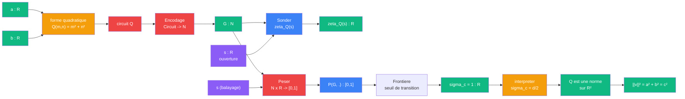

# Pythagore — cablage par Frontiere

> [Retour a Pythagore](../README.md)

## Le probleme

Montrer que `a² + b² = c²` en passant par la zeta d'Epstein. La forme quadratique `Q(m,n) = m² + n²` definit une serie de Dirichlet. [Frontiere](../../../../meta-sens/frontiere.md) trouve `sigma_c = 1`, ce qui garantit que `Q` est une norme valide sur R² — c'est-a-dire que Pythagore tient.

## L'idee

Les trois premiers cablages (Euclide, Mesure, Hilbert) prouvent Pythagore en operant **dans** un espace (Omega, R, E). Celui-ci opere **sur** l'espace : il encode la forme quadratique comme un nombre de Godel, puis interroge la frontiere de convergence du produit associe. La reponse `sigma_c = 1` encode le fait que `Q` definit une norme en dimension 2.

## La zeta d'Epstein

Pour une forme quadratique `Q(m,n) = m² + n²`, la zeta d'Epstein est :

```
zeta_Q(s) = SUM_{(m,n) != (0,0)} 1 / Q(m,n)^s
          = SUM_{(m,n) != (0,0)} 1 / (m² + n²)^s
```

Cette serie converge pour `Re(s) > 1`. L'abscisse de convergence `sigma_c = d/2` ou `d` est la dimension de la forme. Pour `Q(m,n) = m² + n²` en dimension 2 : `sigma_c = 1`.

## Pourquoi sigma_c = 1 implique Pythagore

`sigma_c = d/2 = 1` encode trois choses simultanement :
1. **Dimension** : la forme `Q` opere en dimension 2 (deux cotes `a, b` → un scalaire)
2. **Definitude** : `Q(m,n) > 0` pour `(m,n) != (0,0)` — la forme est definie positive
3. **Norme** : `Q` definit une norme sur R² via `||(a,b)|| = sqrt(Q(a,b)) = sqrt(a² + b²)`

Si la forme etait degeneree (ex: `Q(m,n) = m²`), la serie divergerait differemment. Si la dimension etait autre, `sigma_c != 1`. La valeur `sigma_c = 1` est la signature du fait que `Q = m² + n²` est la bonne forme pour mesurer les distances en dimension 2.

## Circuit



## Role de chaque bloc

| Etape | Bloc | Contrat | Sens dans ce contexte |
|-------|------|---------|----------------------|
| 1 | Forme quadratique | `R x R -> Circuit` | definir `Q(m,n) = m² + n²` |
| 2 | [Encodage](../../../../meta-objets/encodage.md) | `Circuit -> N` | encoder Q comme nombre de Godel |
| 3 | [Sonder](../../../sonder/) | `N x R -> R` | produit d'Euler partiel de zeta_Q |
| 4 | [Peser](../../../../meta-sens/peser.md) | `N x R -> [0,1]` | champ de probabilite de convergence |
| 5 | [Frontiere](../../../../meta-sens/frontiere.md) | `N -> R` | trouver sigma_c = 1 |
| 6 | Interpreter | `R -> R` | sigma_c = d/2 = 1 → Q est une norme en dim 2 |

## Axiomes mobilises

Ce cablage ne repose pas sur des axiomes geometriques ou algebriques comme les trois autres. Il repose sur le **trio Sonder / Frontiere / Reel** :

| Code | Role | Type |
|------|------|------|
| Encodage | transformer le circuit Q en nombre de Godel G | structurel |
| Sonder | calculer le produit d'Euler partiel | numerique |
| Peser | champ de convergence en chaque s | numerique |
| Frontiere | trouver sigma_c, ou le regime constructif s'arrete | numerique |
| sigma_c = d/2 | relier l'abscisse de convergence a la dimension de Q | structurel |

## Le trio Sonder / Frontiere / Reel applique a Pythagore

```
    regime constructif          seuil             regime limite
  |-----------------------------|------------------------------>
       Sonder                  Frontiere              Reel
  zeta_Q(s) partiel            sigma_c = 1        convergence ?
  (somme finie)            (Q est une norme)    (passage a la limite)
```

- **Sonder** : pour `s > 1`, la somme finie `SUM 1/(m²+n²)^s` converge — regime constructif
- **Frontiere** : `sigma_c = 1` — c'est le seuil. La valeur 1 encode la validite de Q comme norme
- **Reel** : pour `s > 1`, le verdict est 1 (convergence). Pour `s <= 1`, il faut un prolongement analytique

## Triple distinction

| Dimension | Pythagore par Frontiere |
|-----------|-------------------------|
| **Sens** | l'hypotenuse se deduit des deux cotes parce que la forme `m² + n²` definit une norme (sigma_c = 1) |
| **Contrat** | `R x R -> R` |
| **Cablage** | forme Q + Encodage + Sonder + Peser + Frontiere + interpreter |

## Ce que ce cablage revele

Les trois premiers cablages prouvent Pythagore **de l'interieur** : ils manipulent des figures, des mesures, ou des vecteurs. Ce cablage prouve Pythagore **de l'exterieur** : il encode la forme quadratique, interroge la frontiere de convergence, et lit la reponse.

C'est un changement de niveau. Les cablages 1-3 sont des **sens** (ils calculent). Le cablage 4 est un **meta-sens** (il interroge les conditions de possibilite du calcul). La question n'est plus "combien vaut c ?" mais "pourquoi la forme a² + b² est-elle la bonne pour mesurer les distances ?".

## Prolongement arithmetique

La zeta d'Epstein `zeta_Q` se factorise en `zeta(s) · L(s, chi_4)`. Cette factorisation relie la geometrie de la norme a la distribution des premiers. Les premiers `p ≡ 1 (mod 4)` sont exactement ceux qui sont sommes de deux carres. Voir le [cablage arithmetique](arithmetique.md) pour le detail.

## Blocs reutilises

| Bloc | Occurrences | Role |
|------|-------------|------|
| [Encodage](../../../../meta-objets/encodage.md) | x1 | circuit Q -> nombre de Godel |
| [Sonder](../../../sonder/) | x1 | produit d'Euler partiel |
| [Peser](../../../../meta-sens/peser.md) | x1 | champ de convergence |
| [Frontiere](../../../../meta-sens/frontiere.md) | x1 | sigma_c = 1 |
