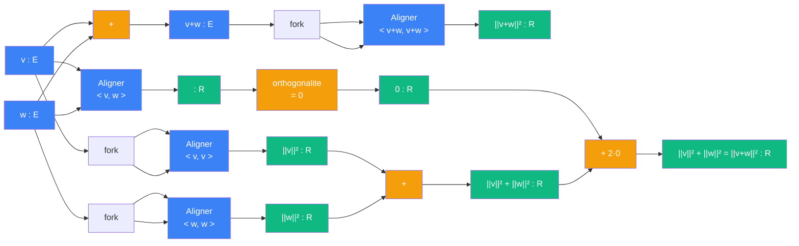

# Pythagore — cablage prehilbertien

> [Retour a Pythagore](../README.md)

## Le probleme

Montrer que `||v+w||² = ||v||² + ||w||²` quand `v ⊥ w`. On developpe `<v+w, v+w>` par bilinearite, et l'orthogonalite annule le terme croise `2<v,w>`.

## Circuit

## Role de chaque bloc

| Etape | Bloc | Contrat | Sens dans ce contexte |
|-------|------|---------|----------------------|
| 1 | fork + [Aligner](../../README.md) | `E -> R` | `<v,v>` = [Normer](../../../normer/) au carre |
| 2 | fork + [Aligner](../../README.md) | `E -> R` | `<w,w>` = [Normer](../../../normer/) au carre |
| 3 | [Aligner](../../README.md) | `E x E -> R` | terme croise `<v,w>` |
| 4 | Orthogonalite (D2) | `R -> R` | annule le terme croise : `<v,w> = 0` |
| 5 | fork + [Aligner](../../README.md) | `E -> R` | `<v+w, v+w>` = norme au carre de la somme |
| 6 | Additionner | `R x R -> R` | `||v||² + ||w||² + 2·0 = ||v+w||²` |

## Axiomes mobilises

| Code | Role | Type |
|------|------|------|
| E1 | structure d'EV pour ecrire `v + w` | structurel |
| E2 | le produit scalaire existe (= [Aligner](../../README.md)) | structurel |
| E3 | bilinearite : developper `<v+w, v+w>` en trois termes | numerique |
| E4 | symetrie : `<v,w> = <w,v>` | structurel |
| E5 | positivite : `<v,v> >= 0`, la racine carree est licite | numerique |
| D1 | norme induite : `||v|| = sqrt(<v,v>)` (= [Normer](../../../normer/)) | numerique |
| D2 | orthogonalite : `<v,w> = 0` annule le terme croise | numerique |

## Triple distinction

| Dimension | Pythagore prehilbertien |
|-----------|-------------------------|
| **Sens** | l'hypotenuse se deduit des deux cotes par annulation du terme croise |
| **Contrat** | `E x E -> R` (avec `v ⊥ w`) |
| **Cablage** | fork + [Aligner](../../README.md) x3 + orthogonalite + additionner |

## Blocs reutilises

| Bloc | Occurrences | Role |
|------|-------------|------|
| [Aligner](../../README.md) | x3 | `<v,v>`, `<w,w>`, `<v,w>` |
| [Normer](../../../normer/) | x2 (implicite) | `<v,v>` et `<w,w>` sont des auto-applications d'Aligner |
| fork | x3 | brancher le meme vecteur sur les deux ports d'Aligner |
