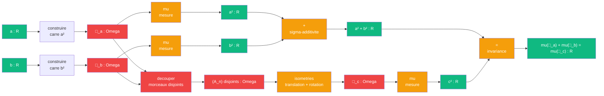

# Pythagore — cablage theorie de la mesure

> [Retour a Pythagore](../README.md)

## Le probleme

Montrer que `mu(a²) + mu(b²) = mu(c²)` en decoupant les carres `a²` et `b²` en morceaux, puis en les recomposant par isometries pour former le carre `c²`. La sigma-additivite et l'invariance par translation garantissent que la mesure se conserve.

## Circuit

## Role de chaque bloc

| Etape | Bloc | Contrat | Sens dans ce contexte |
|-------|------|---------|----------------------|
| 1 | Construire carres | `R -> Omega` | figures mesurables □_a, □_b |
| 2 | Decouper | `Omega x Omega -> (Omega)_n` | morceaux disjoints des deux carres |
| 3 | Isometries | `(Omega)_n -> Omega` | recomposer en □_c par translations et rotations |
| 4 | Mesure mu | `Omega -> R` | aire de chaque carre |
| 5 | Sigma-additivite (M3) | `R x R -> R` | mu(□_a ⊔ □_b) = mu(□_a) + mu(□_b) |
| 6 | Invariance (M4) | `Omega -> Omega` | les isometries conservent la mesure |

## Axiomes mobilises

| Code | Role | Type |
|------|------|------|
| M1 | les aires sont positives | structurel |
| M3 | sigma-additivite : additionner les aires des morceaux | numerique |
| M4 | invariance par translation : recomposer sans changer l'aire | numerique |
| M5 | normalisation : fixe l'unite d'aire | structurel |
| M6 | existence et unicite de Lebesgue | structurel |

## Triple distinction

| Dimension | Pythagore par la mesure |
|-----------|------------------------|
| **Sens** | l'hypotenuse se deduit des deux cotes par conservation de la mesure |
| **Contrat** | `R x R -> R` |
| **Cablage** | construire □_a, □_b + decouper + isometries + sigma-additivite |

## Lien avec le vocabulaire

Ce cablage est le plus eloigne du cadre actuel. Il n'utilise ni [Aligner](../../README.md) ni [Normer](../../../normer/). Il opere dans `Omega` (domaine geometrique) et `R` (scalaires) sans passer par `E`.
