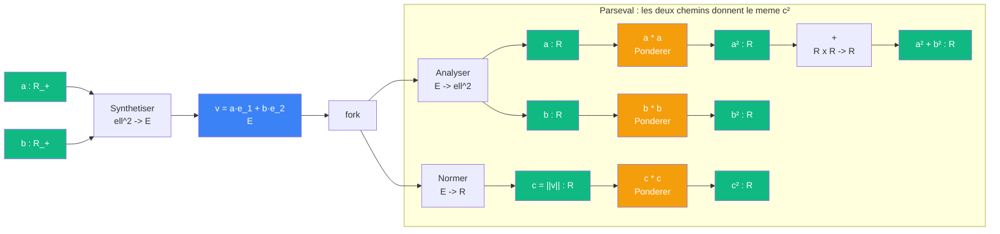

# Pythagore — cablage Parseval (frame)

> [Retour a Pythagore](README.md) | [Analyser](../../observer/analyser.md) | [Synthetiser](../../observer/synthetiser.md) | [Gram](../gram.md)

## Sens

`a² + b² = c²` dit que la norme d'un vecteur se conserve quand on le decompose sur un frame orthonormal. C'est l'identite de Parseval pour un frame a 2 elements.

## Contrat

```
(a, b) ∈ R_+²  -->  c ∈ R_+
```

## Setup

On se place dans `R²` avec le frame orthonormal `{e_1, e_2}` (base canonique).

| Objet | Ce qu'il est |
|-------|-------------|
| `e_1, e_2` | frame orthonormal (2 elements) |
| `v = a·e_1 + b·e_2` | le vecteur a decomposer |
| `a, b` | les coefficients de v dans le frame |
| `c = \|\|v\|\|` | la norme de v |

## Circuit



Les deux branches produisent le meme scalaire `c²`. C'est ca Parseval.

## Role de chaque bloc

| Etape | Bloc | Contrat | Sens |
|-------|------|---------|------|
| 1 | [Synthetiser](../../observer/synthetiser.md) | `ell^2(I) -> E` | construire v a partir des coefficients (a, b) |
| 2 | fork | `E -> E x E` | dupliquer v pour les deux chemins |
| 3a | [Analyser](../../observer/analyser.md) | `E -> ell^2(I)` | retrouver (a, b) par [Mesurer](../../mesurer/) e_1, e_2 |
| 3b | [Normer](../../normer/) | `E -> R` | `c = sqrt(<v,v>)` par auto-[Aligner](../README.md) |
| 4a | [Ponderer](../../ponderer/) (auto) | `R -> R` | `a -> a²` et `b -> b²` |
| 4b | [Ponderer](../../ponderer/) (auto) | `R -> R` | `c -> c²` |
| 5a | Somme | `R x R -> R` | `a² + b²` |
| **=** | Parseval | | `a² + b² = c²` |

## Pourquoi ca marche : la Gram

La cle est que la [Gram](../gram.md) du frame `{e_1, e_2}` est l'identite :

```
G = Phi* Phi = [ <e_i|e_j> ] = I
```

Quand la Gram est I, [Analyser](../../observer/analyser.md) est une **isometrie** : il preserve les normes. Donc :

```
||v||²  =  || Phi* v ||²  =  somme_k |<e_k|v>|²  =  a² + b²
```

Si la Gram n'etait pas I (frame non orthonormal), on aurait :

```
||v||²  =  (Phi* v)^T · G · (Phi* v)  ≠  a² + b²
```

Pythagore echoue quand les axes ne sont pas orthogonaux — c'est la [Gram](../gram.md) qui decide.

## Lien avec les autres cablages de Pythagore

| Cablage | Ce qu'il utilise | Ce qu'il montre |
|---------|-----------------|-----------------|
| Euclide | decoupage dans Omega | a² + b² = c² par les aires |
| Mesure | sigma-additivite dans R | a² + b² = c² par recomposition |
| Hilbert | Aligner + Normer dans E | a² + b² = c² par bilinearite |
| Frontiere | zeta d'Epstein dans N | la forme Q definit une norme |
| **Parseval** | **Analyser + Gram dans E** | **a² + b² = c² par conservation de la norme** |

La difference avec Hilbert : Hilbert developpe `<v+w, v+w>` et annule le terme croise. Parseval decompose `v` sur le frame et somme les carres des coefficients. Le premier raisonne sur **deux vecteurs orthogonaux**, le second sur **un vecteur et son frame**.

## Triple distinction

| Dimension | Parseval |
|-----------|----------|
| **Sens** | la norme se conserve quand on decompose sur un frame orthonormal |
| **Contrat** | `R_+² -> R_+` |
| **Cablage** | [Synthetiser](../../observer/synthetiser.md) + fork + ([Analyser](../../observer/analyser.md) + auto-[Ponderer](../../ponderer/) + somme) = [Normer](../../normer/) + auto-[Ponderer](../../ponderer/) |

## Axiomes

### Structurels (poids constant)

| Axiome | Enonce | Role | Sens utilise |
|--------|--------|------|-------------|
| F1 | `{e_1, e_2}` engendre V | le frame existe — [Analyser](../../observer/analyser.md) et [Synthetiser](../../observer/synthetiser.md) sont definis | frame |
| F2 | Phi* est lineaire | [Analyser](../../observer/analyser.md) distribue sur `+` : `Phi*(u+v) = Phi* u + Phi* v` | [Mesurer](../../mesurer/) |
| E1 | E est un R-espace vectoriel | structure de R² | (partage avec Hilbert) |
| E2 | produit scalaire existe | [Aligner](../README.md) est defini | (partage avec Hilbert) |

### Numeriques (poids variable)

| Axiome | Enonce | Role | Poids |
|--------|--------|------|-------|
| F3 | `<e_i\|e_j> = delta_ij` | [Gram](../gram.md) = I — orthonormalite du frame | `n = 2` (nombre de checks) |
| F4 | `Phi Phi* = P_V` | resolution de l'identite — [Projeter sur V](../../observer/projeter-v.md) = somme des ket-bra | `a² + b²` (somme des contributions) |
| F5 | `v ∈ V` | `P_V v = v` — le vecteur vit dans le span du frame | `c²` (norme de v) |

### Chaine logique

```
F1 (frame existe)
  + F3 (Gram = I)
    => F4 (resolution de l'identite : Phi Phi* = P_V)
      + F5 (v dans V : P_V v = v)
        => ||Phi* v||² = ||v||²
        => a² + b² = c²                (Parseval)
```

F3 est l'axiome decisif : sans orthonormalite, la Gram n'est pas I, [Analyser](../../observer/analyser.md) deforme les normes, et Parseval echoue.

### Comparaison avec Hilbert

| | Hilbert | Parseval |
|---|---|---|
| Axiome cle | D2 (orthogonalite annule `2<v,w>`) | F3 (Gram = I) |
| Poids de l'axiome cle | `2ab` | `n = 2` |
| Mecanisme | developper `<v+w, v+w>` | decomposer `v` sur le frame |
| Annulation | le terme croise `2<v,w> = 0` | pas de terme croise — la Gram diagonale les empeche |
| Objets utilises | Aligner, Normer | Analyser, Synthetiser, Gram, Normer |

Le meme fait (les axes sont perpendiculaires) s'exprime differemment : Hilbert le voit comme `<v,w> = 0` (un [Aligner](../README.md) qui s'annule), Parseval le voit comme `G = I` (une [Gram](../gram.md) diagonale).

---

[<- Pythagore](README.md)
