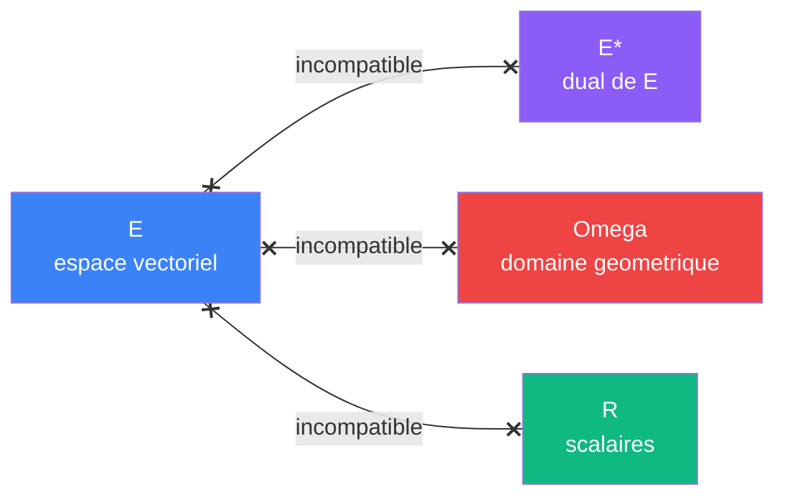

# Espaces

> [Retour au vocabulaire](README.md)

| Espace  | Couleur          | Role                |
|---------|------------------|---------------------|
| `E`     | bleu `#3B82F6`   | espace vectoriel    |
| `E*`    | violet `#8B5CF6` | dual de E           |
| `R`     | vert `#10B981`   | scalaires           |
| `Omega` | rouge `#EF4444`  | domaine geometrique |

Deux ports se connectent seulement si leurs espaces sont identiques. L'incompatibilite est un **refus de typage** en [Agda](../architecture.md#backend--agda), pas un check runtime.

---

[← Concentrer](../sens/concentrer/)
