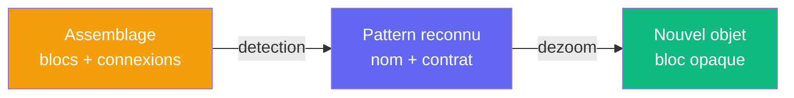

# Reconnaissance de patterns

> [Retour au vocabulaire](README.md) | [Sens](../sens/)

Quand l'utilisateur assemble des objets, le systeme peut **reconnaitre** des structures mathematiques connues dans l'assemblage. C'est l'operation inverse du dezoom : au lieu de cacher la complexite, on la **nomme**.

## Exemple : contraction dans la sphere

Dans la [projection de la sphere](../cablages/projeter.md), la sphere fournit ses normales `n(x)` au produit de dualite et son domaine a l'integration. Ce partage revele une **contraction tensorielle** : la variable `n(x)` est produite et consommee par le meme objet (la sphere).

| Signal | Pattern | Dans la sphere |
|--------|---------|----------------|
| Port partage entre deux blocs | Contraction tensorielle | `n(x)` entre dualite et integration |
| Variable fixee | Fonctionnelle | `phi` fixe donne `Omega -> R` |

En [Agda](../architecture.md#backend--agda), un pattern est un **type** : reconnaitre un pattern, c'est construire un terme de ce type a partir de l'assemblage. Si la construction type-checke, le pattern est valide. Phase [P3](../roadmap.md#phases) de la feuille de route.
