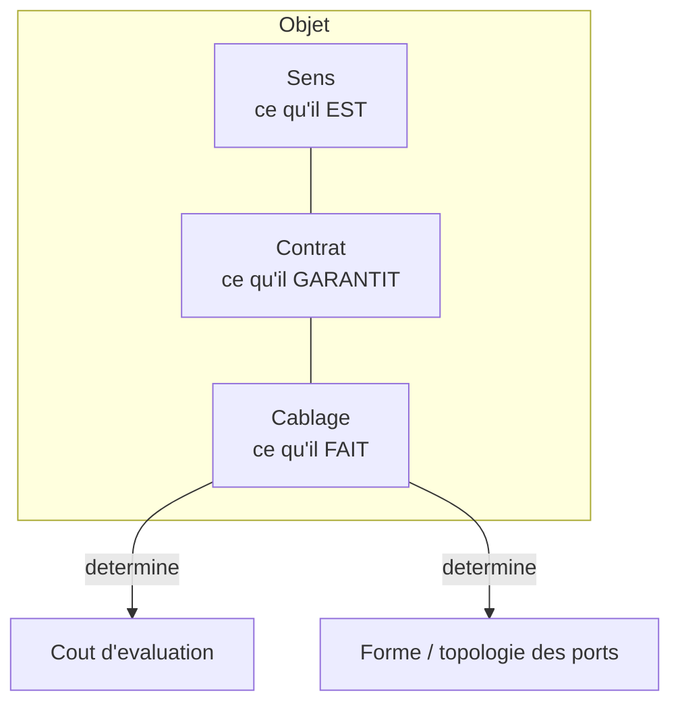

# Triple distinction

> [Retour au vocabulaire](README.md) | [Sens](../sens/)

Chaque [objet mathematique](../sens/) a trois dimensions :

| Dimension | Nature |
|-----------|--------|
| Ce qu'il **EST** | son sens |
| Ce qu'il **GARANTIT** | ses contrats |
| Ce qu'il **FAIT** | son cablage interne |

Le cablage interne determine simultanement le **cout** d'evaluation et la **forme** (topologie des ports).

Modifier un cablage modifie l'objet, pas la structure.

## Application : le circuit de la sphere

| Dimension | Circuit de la [sphere](../cablages/projeter.md) |
|-----------|---------------------------------------------------------------------------|
| **Sens** | ombre et intensite de la sphere |
| **Contrat** | `Omega x E* x R -> R` |
| **Cablage** | produit de dualite + valeur absolue + integration + inverse carre + produit lineaire |

Le sens dit **quoi** (l'ombre), le contrat dit **quels types** entrent et sortent, le cablage dit **comment** les blocs sont connectes.
