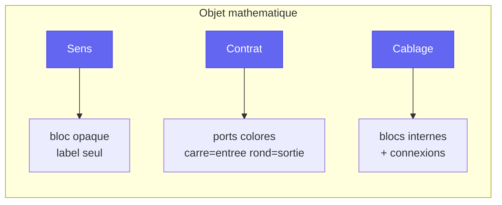

# Trois vues

> [Retour au vocabulaire](README.md) | [Sens](../sens/)

Chaque objet propose **trois boutons** accessibles en permanence :

Pas de navigation sequentielle : les trois vues coexistent, l'utilisateur choisit librement.

## Application : le circuit de la sphere

| Vue | Ce qu'on voit |
|-----|---------------|
| **Sens** | un bloc "ombre de la sphere" |
| **Contrat** | trois ports d'entree (`Omega`, `E*`, `R`) et un port de sortie (`R`) |
| **Cablage** | les cinq blocs internes et leurs connexions |
